# Chronicle Architecture

## Overview

Chronicle is an embedded time-series database for Go, designed for constrained and edge environments. It provides:

- **Single-file storage** with append-only writes
- **SQL-like query language** for familiar data access
- **PromQL subset support** for Prometheus compatibility
- **Columnar compression** using Gorilla and delta-of-delta algorithms
- **Pluggable storage backends** (file, memory, S3, tiered)
- **Optional HTTP API** with Prometheus remote write and OTLP support

## High-Level Architecture

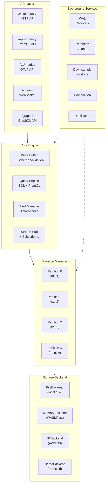

### ASCII Diagram (for terminals)

```
┌─────────────────────────────────────────────────────────────────────────────┐
│                              Chronicle DB                                    │
├─────────────────────────────────────────────────────────────────────────────┤
│  ┌───────────────┐  ┌───────────────┐  ┌───────────────┐  ┌──────────────┐ │
│  │   HTTP API    │  │  PromQL API   │  │  OTLP API     │  │  WebSocket   │ │
│  │ /write,/query │  │ /api/v1/query │  │ /v1/metrics   │  │  /stream     │ │
│  └───────┬───────┘  └───────┬───────┘  └───────┬───────┘  └──────┬───────┘ │
│          │                  │                  │                  │         │
│  ┌───────▼──────────────────▼──────────────────▼──────────────────▼───────┐ │
│  │                         Core Engine                                     │ │
│  │  ┌─────────────┐  ┌─────────────┐  ┌─────────────┐  ┌────────────────┐ │ │
│  │  │ Write Buffer│  │Query Engine │  │Alert Manager│  │ Stream Hub     │ │ │
│  │  │  + Schema   │  │ SQL+PromQL  │  │ + Webhooks  │  │ + Subscribers  │ │ │
│  │  └──────┬──────┘  └──────┬──────┘  └──────┬──────┘  └────────────────┘ │ │
│  └─────────┼────────────────┼────────────────┼───────────────────────────┘  │
│            │                │                │                              │
│  ┌─────────▼────────────────▼────────────────▼─────────────────────────────┐│
│  │                       Partition Manager                                  ││
│  │  ┌──────────┐  ┌──────────┐  ┌──────────┐  ┌──────────┐  ┌───────────┐ ││
│  │  │Partition0│  │Partition1│  │Partition2│  │    ...   │  │PartitionN │ ││
│  │  │ [t0,t1)  │  │ [t1,t2)  │  │ [t2,t3)  │  │          │  │ [tn,now)  │ ││
│  │  └────┬─────┘  └────┬─────┘  └────┬─────┘  └──────────┘  └─────┬─────┘ ││
│  └───────┼─────────────┼─────────────┼────────────────────────────┼───────┘│
│          └─────────────┴─────────────┴────────────────────────────┘        │
│                                      │                                      │
│  ┌───────────────────────────────────▼─────────────────────────────────────┐│
│  │                       Storage Backend                                    ││
│  │  ┌──────────────┐  ┌──────────────┐  ┌──────────────┐  ┌─────────────┐ ││
│  │  │ FileBackend  │  │MemoryBackend │  │  S3Backend   │  │TieredBackend│ ││
│  │  │ (local disk) │  │ (WASM/test)  │  │ (AWS S3)     │  │ (hot+cold)  │ ││
│  │  └──────────────┘  └──────────────┘  └──────────────┘  └─────────────┘ ││
│  └──────────────────────────────────────────────────────────────────────────┘│
│                                                                              │
│  ┌───────────────────────────────────────────────────────────────────────┐  │
│  │                    Background Services                                 │  │
│  │  ┌──────────┐  ┌──────────┐  ┌──────────┐  ┌──────────┐  ┌─────────┐ │  │
│  │  │   WAL    │  │Retention │  │Downsample│  │Compaction│  │Replicat.│ │  │
│  │  │ Recovery │  │ Cleanup  │  │ Workers  │  │          │  │         │ │  │
│  │  └──────────┘  └──────────┘  └──────────┘  └──────────┘  └─────────┘ │  │
│  └───────────────────────────────────────────────────────────────────────┘  │
└─────────────────────────────────────────────────────────────────────────────┘
```

## Storage Model

### Partitions

Data is organized into time-bounded partitions (default: 1 hour). Each partition contains:

- **Header**: Metadata (time range, series count)
- **Series Index**: B-tree for O(log n) series lookup
- **Column Blocks**: Compressed timestamp and value columns

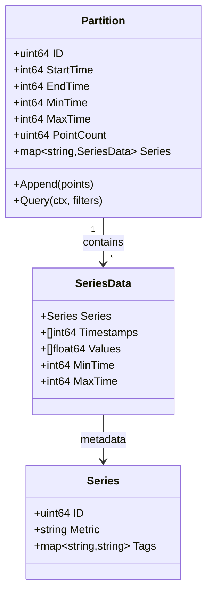

### Partition Internal Layout

```
┌──────────────────────────────────────────┐
│ Partition Header                          │
├──────────────────────────────────────────┤
│ Series: "cpu{host=a}"                    │
│   ├─ Timestamps: [t1, t2, t3, ...]       │  ◄─ Delta-of-delta compressed
│   └─ Values: [0.5, 0.7, 0.6, ...]        │  ◄─ Gorilla XOR compressed
├──────────────────────────────────────────┤
│ Series: "cpu{host=b}"                    │
│   ├─ Timestamps: [t1, t2, t3, ...]       │
│   └─ Values: [0.8, 0.9, 0.85, ...]       │
└──────────────────────────────────────────┘
```

### File Format

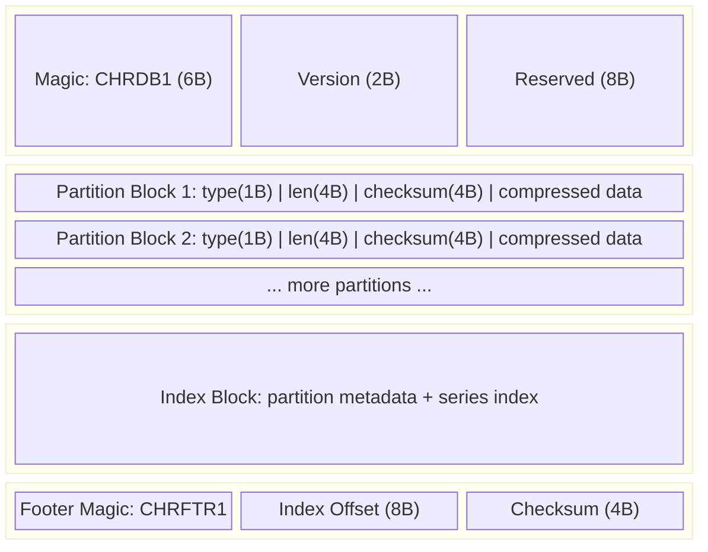

### Compression Algorithms

| Column Type | Algorithm | Compression Ratio | Description |
|-------------|-----------|-------------------|-------------|
| Timestamps | Delta-of-delta | ~10:1 for regular intervals | Encodes difference of differences |
| Float values | Gorilla XOR | ~12:1 (Facebook paper) | XOR with previous, bit-pack leading/trailing zeros |
| String tags | Dictionary encoding | Depends on cardinality | Map strings to integers |

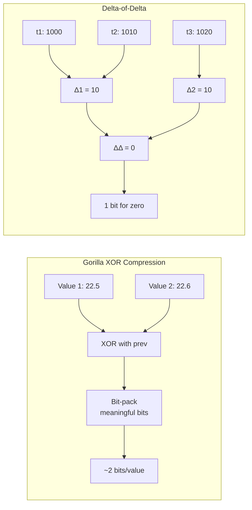

## Query Engine

### SQL-Like Syntax

```sql
SELECT mean(value), max(value)
FROM cpu
WHERE host = 'server-01'
  AND time >= '2024-01-01' AND time < '2024-01-02'
GROUP BY time(5m)
```

### Query Execution Pipeline

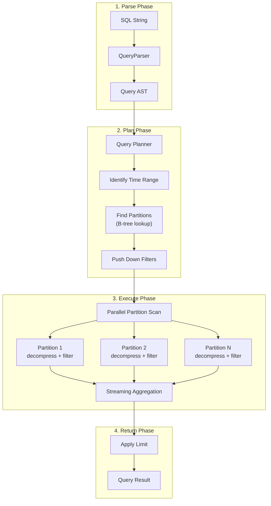

### Query Data Flow

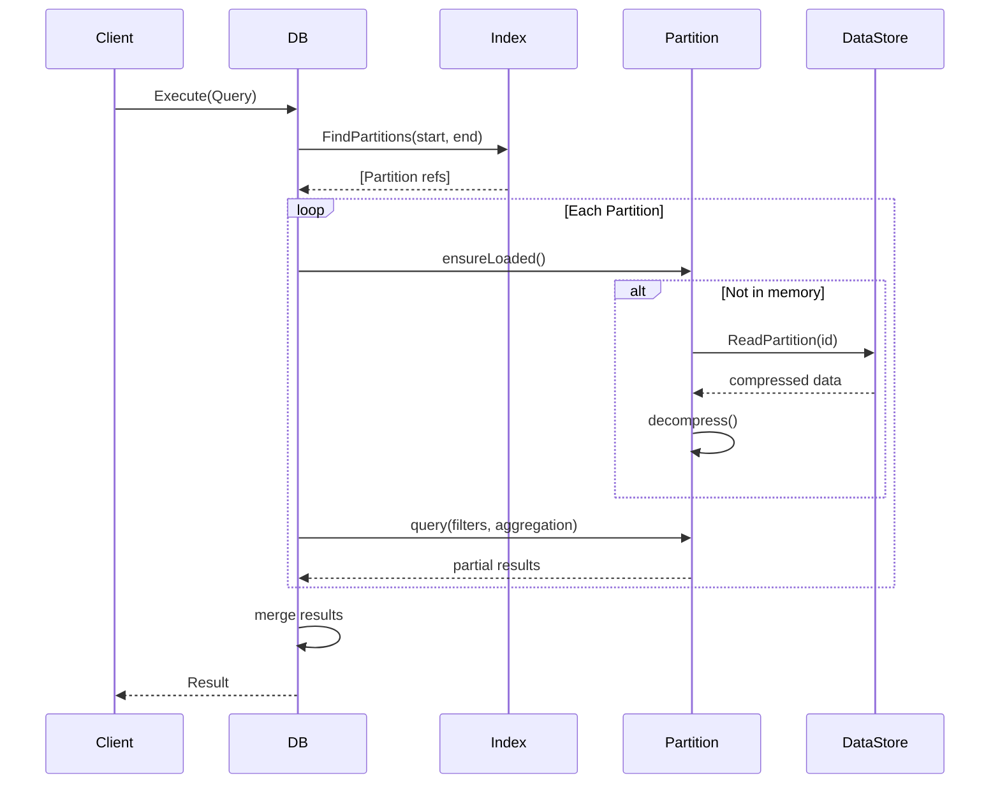

## Concurrency Model

- **Single writer**: All writes go through a buffered channel
- **Multiple readers**: Queries run concurrently
- **Background tasks**: Flush, downsampling, retention run in separate goroutines
- **Graceful shutdown**: Context propagation for clean termination

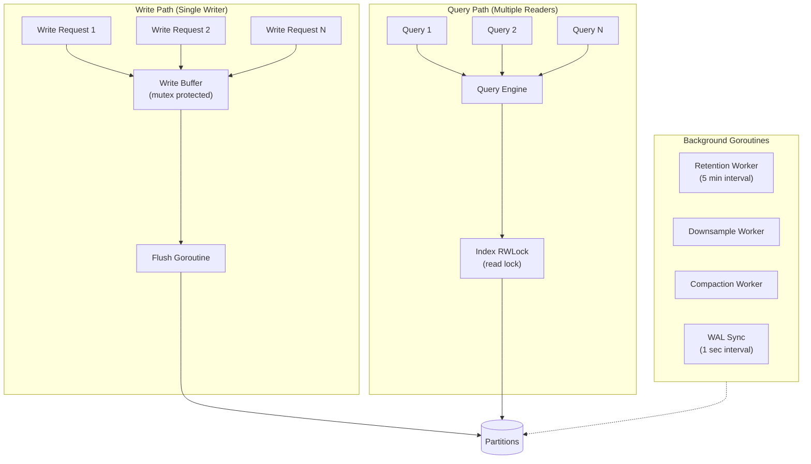

## Package Structure

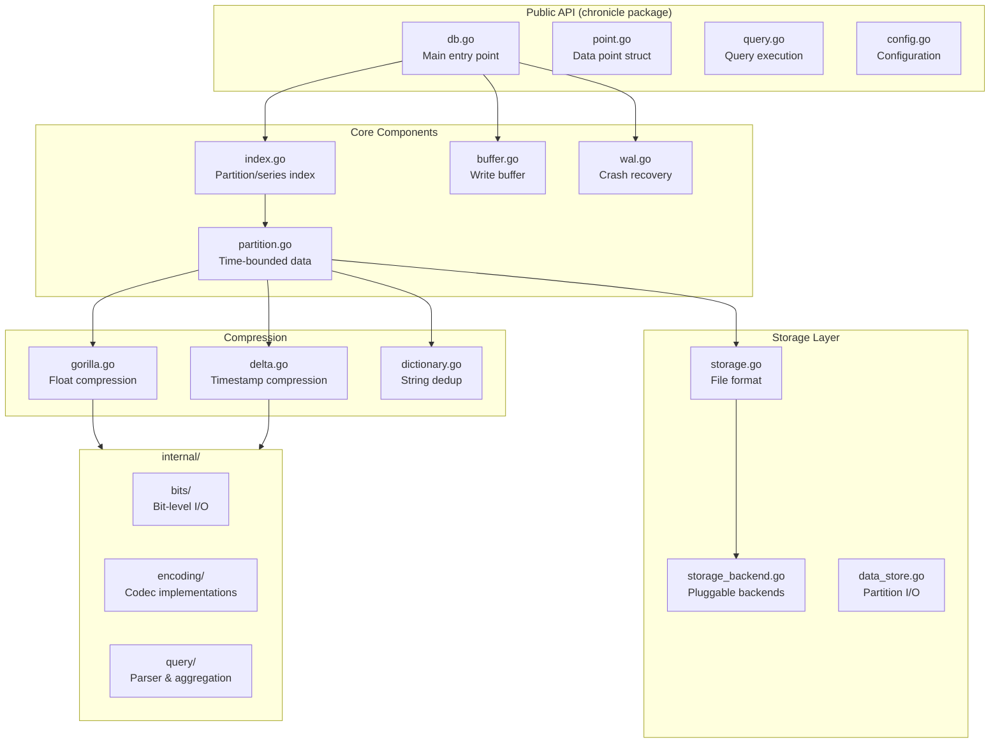

### Directory Layout

```
chronicle/
├── internal/
│   ├── bits/       # Bit-level I/O for compression
│   ├── encoding/   # Gorilla, delta, dictionary codecs
│   └── query/      # SQL parser and aggregation
├── examples/
│   └── simple/     # Usage examples
└── *.go            # Public API (DB, Point, Query, etc.)
```

## Key Design Decisions

### 1. Single-File Storage
**Decision**: Store all data in one file instead of directory structure.
**Rationale**: Simplifies deployment, backup, and atomic operations for edge devices.
**Trade-off**: Limited to ~2GB practical size on 32-bit systems.

### 2. Append-Only Writes
**Decision**: Never modify existing data, only append.
**Rationale**: Enables simple crash recovery, reduces disk wear on SSDs/flash.
**Trade-off**: Requires compaction for space reclamation.

### 3. In-Process Only
**Decision**: No client-server mode, embedding only.
**Rationale**: Minimal overhead for edge/IoT applications.
**Trade-off**: Single-process access only (use replication for multi-process).

### 4. Pluggable Storage Backends
**Decision**: Abstract storage behind an interface.
**Rationale**: Enables S3 for cloud, memory for WASM, tiered for cost optimization.
**Trade-off**: Slight performance overhead from interface dispatch.

### 5. Multi-Tenancy via Tags
**Decision**: Implement tenancy using a reserved `__tenant__` tag rather than separate databases.
**Rationale**: Single codebase, shared infrastructure, simpler operations.
**Trade-off**: Tenant isolation is logical, not physical.

---

## Write Path Deep Dive

The write path is optimized for high-throughput ingestion while maintaining durability.

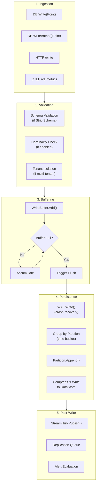

### Write Path Sequence

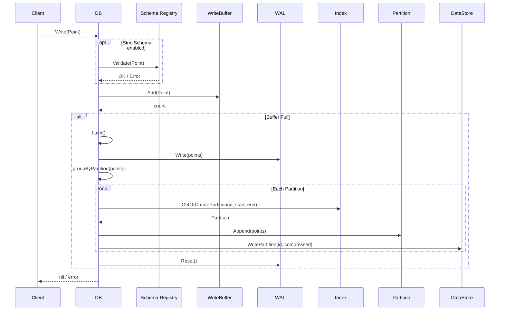

---

## Feature Architecture

### Storage Backends

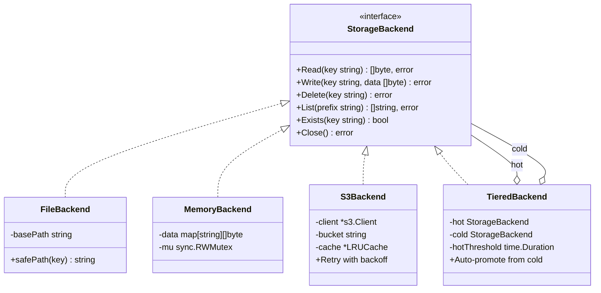

```
┌─────────────────────────────────────────────────────────────────┐
│                    StorageBackend Interface                      │
│  Read(key) | Write(key, data) | Delete(key) | List(prefix)     │
└─────────────────────────────────────────────────────────────────┘
        │                │                │                │
        ▼                ▼                ▼                ▼
┌─────────────┐  ┌─────────────┐  ┌─────────────┐  ┌─────────────┐
│ FileBackend │  │MemoryBackend│  │  S3Backend  │  │TieredBackend│
│             │  │             │  │             │  │  hot + cold │
│ os.ReadFile │  │ map[string] │  │ AWS SDK v2  │  │ auto-promote│
│ os.WriteFile│  │   []byte    │  │ GetObject   │  │ from cold   │
└─────────────┘  └─────────────┘  └─────────────┘  └─────────────┘
```

### Streaming Architecture

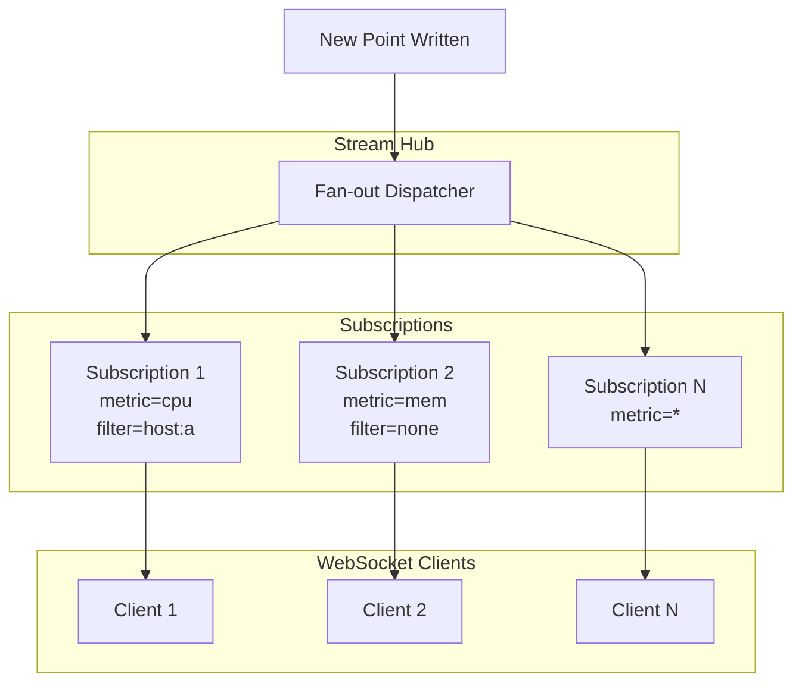

```
                    ┌──────────────────────────┐
                    │       Stream Hub         │
                    │  (fan-out dispatcher)    │
                    └────────────┬─────────────┘
                                 │
        ┌────────────────────────┼────────────────────────┐
        │                        │                        │
        ▼                        ▼                        ▼
┌───────────────┐    ┌───────────────┐    ┌───────────────┐
│ Subscription 1│    │ Subscription 2│    │ Subscription N│
│ metric=cpu    │    │ metric=mem    │    │ metric=*      │
│ filter=host:a │    │ filter=none   │    │ filter=none   │
└───────┬───────┘    └───────┬───────┘    └───────┬───────┘
        │                    │                    │
        ▼                    ▼                    ▼
   WebSocket             WebSocket            WebSocket
    Client 1              Client 2             Client N
```

### Alerting Flow

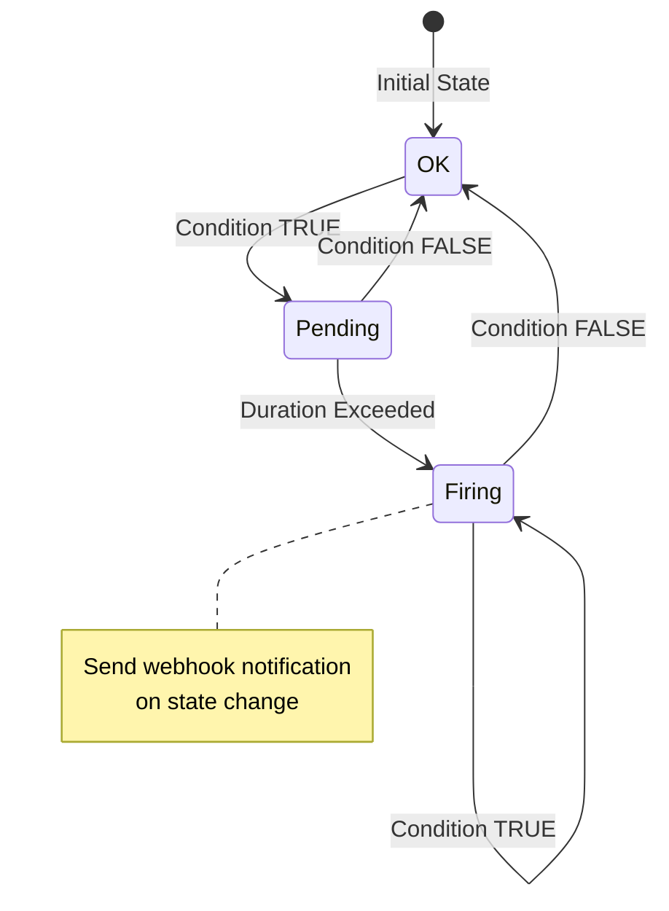

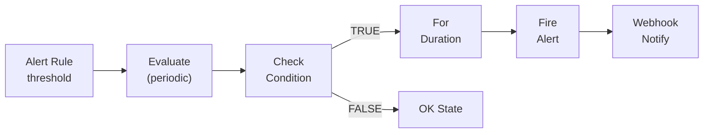

```
┌─────────────┐     ┌─────────────┐     ┌─────────────┐
│ Alert Rule  │────►│  Evaluate   │────►│   Check     │
│ threshold   │     │  (periodic) │     │  Condition  │
└─────────────┘     └─────────────┘     └──────┬──────┘
                                               │
                           ┌───────────────────┴───────────────────┐
                           │                                       │
                           ▼                                       ▼
                    ┌─────────────┐                         ┌─────────────┐
                    │  Condition  │                         │  Condition  │
                    │    TRUE     │                         │    FALSE    │
                    └──────┬──────┘                         └─────────────┘
                           │
                           ▼
                    ┌─────────────┐
                    │  For        │ (duration check)
                    │  Duration   │
                    └──────┬──────┘
                           │
                           ▼
                    ┌─────────────┐
                    │   Fire      │
                    │   Alert     │
                    └──────┬──────┘
                           │
                           ▼
                    ┌─────────────┐
                    │  Webhook    │
                    │  Notify     │
                    └─────────────┘
```

### Schema Validation

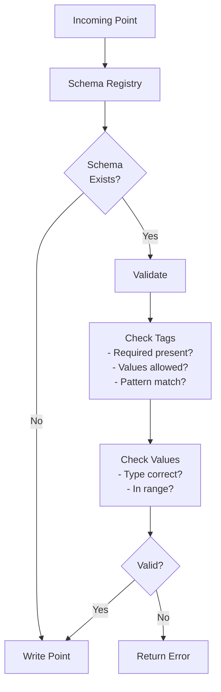

```
┌─────────────┐     ┌─────────────┐     ┌─────────────┐
│   Point     │────►│   Schema    │────►│  Validate   │
│  (incoming) │     │  Registry   │     │  - Tags     │
└─────────────┘     └─────────────┘     │  - Values   │
                                        └──────┬──────┘
                                               │
                           ┌───────────────────┴───────────────────┐
                           │                                       │
                           ▼                                       ▼
                    ┌─────────────┐                         ┌─────────────┐
                    │    PASS     │                         │    FAIL     │
                    │   (write)   │                         │   (error)   │
                    └─────────────┘                         └─────────────┘
```

---

## Analytics Features

### Time-Series Forecasting

Chronicle includes built-in forecasting with multiple algorithms:

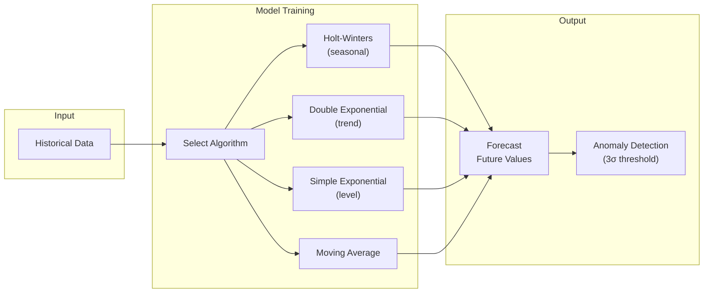

```
┌─────────────────────────────────────────────────────────────────┐
│                    Forecasting Engine                            │
├─────────────────────────────────────────────────────────────────┤
│                                                                  │
│  ┌──────────────┐    ┌──────────────┐    ┌──────────────┐      │
│  │   History    │───►│   Train      │───►│  Forecast    │      │
│  │   Data       │    │   Model      │    │  Future      │      │
│  └──────────────┘    └──────────────┘    └──────────────┘      │
│                                                │                 │
│                                                ▼                 │
│  ┌─────────────────────────────────────────────────────────┐   │
│  │                    Algorithms                            │   │
│  │  ┌────────────┐  ┌────────────┐  ┌────────────┐        │   │
│  │  │Holt-Winters│  │  Double    │  │  Simple    │        │   │
│  │  │(seasonal)  │  │Exponential │  │Exponential │        │   │
│  │  └────────────┘  └────────────┘  └────────────┘        │   │
│  └─────────────────────────────────────────────────────────┘   │
│                                                                  │
│  ┌─────────────────────────────────────────────────────────┐   │
│  │                Anomaly Detection                         │   │
│  │  Prediction + Confidence Bounds ──► Outlier Score        │   │
│  └─────────────────────────────────────────────────────────┘   │
└─────────────────────────────────────────────────────────────────┘
```

### Recording Rules

Pre-compute expensive queries on a schedule:

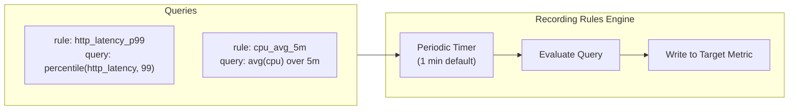

```
┌─────────────┐     ┌─────────────┐     ┌─────────────┐
│   Rule      │────►│  Evaluate   │────►│   Write     │
│ (periodic)  │     │  Query      │     │  Results    │
└─────────────┘     └─────────────┘     └──────┬──────┘
                                               │
                                               ▼
                                        ┌─────────────┐
                                        │  Target     │
                                        │  Metric     │
                                        └─────────────┘
```

### Native Histograms

Prometheus-compatible exponential bucketing:

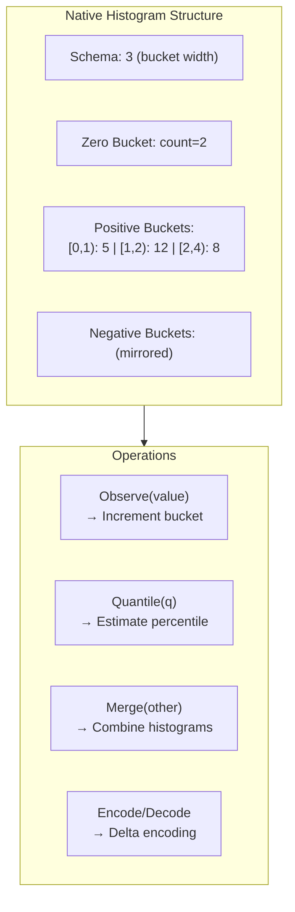

```
┌─────────────────────────────────────────────────────────────────┐
│                    Native Histogram                              │
├─────────────────────────────────────────────────────────────────┤
│  Schema: 3 (exponential bucket width)                           │
│                                                                  │
│  Positive Buckets:  [0, 1)   [1, 2)   [2, 4)   [4, 8)   ...   │
│  Counts:               5        12       8        3              │
│                                                                  │
│  Zero Bucket:   count = 2                                        │
│  Negative Buckets: (mirrored)                                    │
│                                                                  │
│  Operations:                                                     │
│    Observe(value)     ─► Increment bucket                        │
│    Quantile(q)        ─► Estimate percentile                     │
│    Merge(other)       ─► Combine histograms                      │
│    Encode()/Decode()  ─► Efficient serialization                 │
└─────────────────────────────────────────────────────────────────┘
```

---

## Distributed Features

### Query Federation

Query across multiple Chronicle instances:

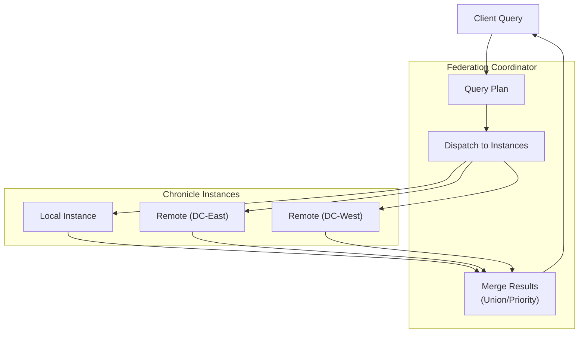

```
                         ┌─────────────────────┐
                         │      Client         │
                         └──────────┬──────────┘
                                    │
                                    ▼
                         ┌─────────────────────┐
                         │    Federation       │
                         │    Coordinator      │
                         └──────────┬──────────┘
                                    │
        ┌───────────────────────────┼───────────────────────────┐
        │                           │                           │
        ▼                           ▼                           ▼
┌───────────────┐         ┌───────────────┐         ┌───────────────┐
│    Local      │         │   Remote 1    │         │   Remote N    │
│   Chronicle   │         │  (DC-East)    │         │  (DC-West)    │
└───────┬───────┘         └───────┬───────┘         └───────┬───────┘
        │                         │                         │
        └─────────────────────────┼─────────────────────────┘
                                  │
                                  ▼
                         ┌─────────────────────┐
                         │   Merge Results     │
                         │   (Union/Priority)  │
                         └─────────────────────┘
```

### Backup & Recovery

Full and incremental backup flow:

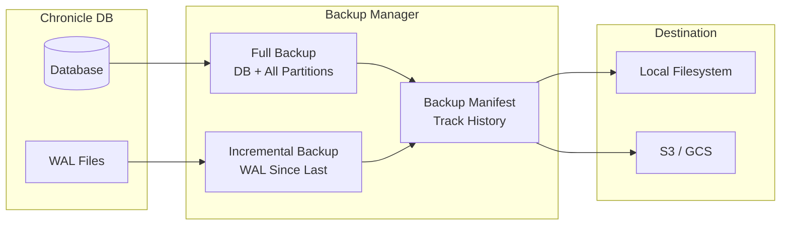

```
┌─────────────────────────────────────────────────────────────────┐
│                    Backup Manager                                │
├─────────────────────────────────────────────────────────────────┤
│                                                                  │
│  Full Backup:                                                    │
│    DB State + All Partitions ──► Compressed Archive              │
│                                                                  │
│  Incremental Backup:                                             │
│    WAL Since Last Backup ──► Delta Archive                       │
│                                                                  │
│  ┌──────────────┐    ┌──────────────┐    ┌──────────────┐      │
│  │  Chronicle   │───►│   Backup     │───►│  Destination │      │
│  │     DB       │    │   Manager    │    │  (Local/S3)  │      │
│  └──────────────┘    └──────────────┘    └──────────────┘      │
│                                                                  │
│  Retention: Keep last N backups, auto-cleanup                   │
└─────────────────────────────────────────────────────────────────┘
```

### Replication

Outbound replication for disaster recovery:

```mermaid
sequenceDiagram
    participant Writer
    participant DB
    participant Queue as Replication Queue
    participant Remote as Remote Target

    Writer->>DB: Write(points)
    DB->>DB: Persist locally
    DB->>Queue: Enqueue(points)
    
    loop Batch Processing
        Queue->>Queue: Accumulate batch<br>(1000 points / 512KB)
        Queue->>Remote: POST /write (batch)
        alt Success
            Remote-->>Queue: 200 OK
            Queue->>Queue: Dequeue batch
        else Failure
            Remote-->>Queue: Error
            Queue->>Queue: Exponential backoff
            Note over Queue: Circuit breaker<br>after N failures
        end
    end
```

---

## API Architecture

### GraphQL Layer

```mermaid
flowchart TB
    subgraph Endpoints["GraphQL Endpoints"]
        Post["/graphql (POST)"]
        Playground["/graphql/playground"]
        WS["WebSocket Subscriptions"]
    end

    subgraph Schema["GraphQL Schema"]
        Query["Query<br>{ metrics, points, stats }"]
        Mutation["Mutation<br>{ write, delete }"]
        Subscription["Subscription<br>{ live }"]
    end

    subgraph Resolvers
        QE["Query Engine"]
        Writer["Data Writer"]
        StreamHub["Stream Hub"]
    end

    Post --> Schema
    WS --> Subscription
    Query --> QE
    Mutation --> Writer
    Subscription --> StreamHub
```

```
┌─────────────────────────────────────────────────────────────────┐
│                    GraphQL Server                                │
├─────────────────────────────────────────────────────────────────┤
│                                                                  │
│  Schema:                                                         │
│    Query { metrics, points, stats }                             │
│    Mutation { write, delete }                                   │
│    Subscription { live }                                        │
│                                                                  │
│  ┌──────────────┐    ┌──────────────┐    ┌──────────────┐      │
│  │   /graphql   │    │  /graphql/   │    │ WebSocket    │      │
│  │   (POST)     │    │  playground  │    │ Subscriptions│      │
│  └──────────────┘    └──────────────┘    └──────────────┘      │
│                                                                  │
└─────────────────────────────────────────────────────────────────┘
```

### Admin UI

```
┌─────────────────────────────────────────────────────────────────┐
│                    Admin Dashboard                               │
├─────────────────────────────────────────────────────────────────┤
│                                                                  │
│  ┌──────────────┐  ┌──────────────┐  ┌──────────────┐          │
│  │   Stats      │  │   Metrics    │  │   Query      │          │
│  │   Panel      │  │   Explorer   │  │   Editor     │          │
│  │ - Uptime     │  │ - List all   │  │ - SQL/PromQL │          │
│  │ - Memory     │  │ - Details    │  │ - Results    │          │
│  │ - Goroutines │  │ - Filter     │  │ - Export     │          │
│  └──────────────┘  └──────────────┘  └──────────────┘          │
│                                                                  │
│  API Endpoints:                                                  │
│    /admin           ─► Dashboard HTML                           │
│    /admin/api/stats ─► JSON stats                               │
│    /admin/api/health─► Health check                             │
└─────────────────────────────────────────────────────────────────┘
```

---

## Observability Features

### Cardinality Management

Track and limit high-cardinality series:

```mermaid
flowchart TB
    Write["Incoming Write"] --> Extract["Extract Series Key<br>(metric + tags)"]
    Extract --> MetricCheck{"Per-Metric<br>Limit OK?"}
    MetricCheck -->|No| Alert1["Generate Alert"]
    MetricCheck -->|Yes| GlobalCheck{"Global<br>Limit OK?"}
    GlobalCheck -->|No| Alert2["Generate Alert"]
    GlobalCheck -->|Yes| HardCheck{"Hard<br>Limit?"}
    HardCheck -->|Exceeded| Reject["Reject Write"]
    HardCheck -->|OK| Accept["Accept Write"]
    Alert1 --> HardCheck
    Alert2 --> HardCheck
```

```
┌─────────────────────────────────────────────────────────────────┐
│                 Cardinality Tracker                              │
├─────────────────────────────────────────────────────────────────┤
│                                                                  │
│  Per-Metric Limits:                                              │
│    cpu        ─► 10,000 max series                              │
│    http_req   ─► 50,000 max series                              │
│                                                                  │
│  Global Limit: 100,000 total series                             │
│                                                                  │
│  On Write:                                                       │
│    1. Extract series key (metric + tags)                        │
│    2. Check per-metric limit                                    │
│    3. Check global limit                                        │
│    4. Generate alert if threshold exceeded                      │
│    5. Reject write if hard limit exceeded                       │
│                                                                  │
└─────────────────────────────────────────────────────────────────┘
```

### Exemplars

Link metrics to distributed traces:

```mermaid
flowchart LR
    subgraph Metric
        M["http_latency<br>0.125s"]
    end

    subgraph Exemplar
        E["trace_id: abc123<br>span_id: def456"]
    end

    subgraph Tracing["Tracing Backend"]
        Jaeger["Jaeger / Zipkin / etc"]
    end

    M <-->|"linked"| E
    E -->|"lookup"| Jaeger
```

```
┌──────────────┐              ┌──────────────┐
│    Metric    │──────────────│   Exemplar   │
│ http_latency │  linked to   │  trace_id    │
│   0.125s     │              │  span_id     │
└──────────────┘              └──────────────┘
         │                            │
         └────────────────────────────┘
                      │
                      ▼
              ┌──────────────┐
              │   Tracing    │
              │   Backend    │
              │ (Jaeger/etc) │
              └──────────────┘
```

---

## Recovery & Crash Safety

Chronicle uses a Write-Ahead Log (WAL) to ensure durability:

```mermaid
sequenceDiagram
    participant Client
    participant DB
    participant WAL
    participant Partitions
    participant Disk

    Note over DB: Normal Operation
    Client->>DB: Write(points)
    DB->>WAL: Append(points)
    WAL->>Disk: fsync (periodic)
    DB->>Partitions: Buffer in memory
    
    Note over DB: Flush Triggered
    DB->>Partitions: Persist to disk
    Partitions->>Disk: Write partition block
    DB->>WAL: Reset()

    Note over DB: Crash Recovery (on startup)
    DB->>Disk: Load index from footer
    DB->>WAL: ReadAll()
    WAL-->>DB: Unsynced points
    DB->>Partitions: Replay points
    DB->>WAL: Reset()
```

---

## Performance Characteristics

### Complexity Analysis

| Operation | Time Complexity | Space Complexity | Notes |
|-----------|-----------------|------------------|-------|
| Write (single point) | O(1) amortized | O(1) | Buffered, WAL append |
| Write (batch N points) | O(N) | O(N) | Single WAL write |
| Query (time range) | O(log P + S×D) | O(R) | P=partitions, S=series, D=datapoints, R=results |
| Partition lookup | O(log P) | O(1) | B-tree index |
| Series filter | O(S) | O(M) | M=matching series |
| Aggregation | O(D) | O(B) | B=buckets |
| Compression (Gorilla) | O(N) | O(N) | Single pass |

### Memory Budget

```mermaid
pie title Memory Distribution (64MB default)
    "Write Buffer" : 10
    "Partition Cache" : 40
    "Index Structures" : 20
    "Query Working Memory" : 20
    "WAL Buffer" : 10
```

### Typical Performance

| Metric | Value | Conditions |
|--------|-------|------------|
| Write throughput | ~76K batches/sec | 10K points/batch |
| Query latency (p99) | <10ms | 10K points, aggregation |
| Compression ratio | 10-15x | Regular intervals, similar values |
| Cold start | <100ms | 1GB database |

See [BENCHMARKS.md](./BENCHMARKS.md) for detailed measurements.

---

## Security Architecture

```mermaid
flowchart TB
    subgraph Input["Input Validation"]
        BodyLimit["Request Body Limit<br>(10MB default)"]
        Timeout["Query Timeout<br>(30s default)"]
        PathCheck["Path Traversal<br>Protection"]
    end

    subgraph Encryption["Encryption at Rest"]
        KDF["PBKDF2 Key Derivation<br>(100K iterations)"]
        AES["AES-256-GCM<br>Authenticated Encryption"]
        Salt["32-byte Random Salt"]
        Nonce["12-byte Random Nonce"]
    end

    subgraph Isolation["Tenant Isolation"]
        TagBased["__tenant__ Tag<br>Logical Isolation"]
        Filter["Query-time Filtering"]
    end

    Input --> Core["Core Engine"]
    Encryption --> Storage["Storage Layer"]
    Isolation --> Core
```

**Security Features:**
- No `unsafe` package usage in core code
- Request body limits prevent memory exhaustion
- Query timeouts prevent resource starvation
- Path traversal protection in storage backends
- Optional AES-256-GCM encryption at rest

---

## Error Handling

Chronicle uses typed errors for precise error handling:

```mermaid
classDiagram
    class ChronicleError {
        <<interface>>
        +Error() string
        +Unwrap() error
    }

    class QueryError {
        +Type QueryErrorType
        +Message string
        +Query string
    }

    class StorageError {
        +Op string
        +Path string
        +Err error
    }

    class ValidationError {
        +Field string
        +Value any
        +Constraint string
    }

    ChronicleError <|-- QueryError
    ChronicleError <|-- StorageError
    ChronicleError <|-- ValidationError
```

**Error Types:**
- `ErrDatabaseClosed` - Operations on closed DB
- `ErrQueryTimeout` - Query exceeded timeout
- `ErrInvalidQuery` - Malformed query syntax
- `ErrSchemaViolation` - Schema validation failed
- `ErrCardinalityLimit` - Too many unique series
- `ErrStorageFull` - Max storage exceeded

---

## Limitations & Trade-offs

| Limitation | Reason | Workaround |
|------------|--------|------------|
| Single-process only | Embedded design, no IPC | Use replication for multi-process |
| ~2GB practical limit (32-bit) | File offset limitations | Use 64-bit systems or partitioning |
| No transactions | Append-only simplicity | Use WAL for consistency |
| Logical tenant isolation | Single-file design | Use separate databases if physical isolation required |
| No secondary indexes | Time-series optimized | Use tag filtering + time range |

---

## See Also

- [README](../README.md) - Quick start and API overview
- [FEATURES](./FEATURES.md) - Detailed feature documentation
- [CONFIGURATION](./CONFIGURATION.md) - All configuration options
- [API](./API.md) - HTTP API reference
- [CONTRIBUTING](../CONTRIBUTING.md) - Development setup
- [pkg.go.dev](https://pkg.go.dev/github.com/chronicle-db/chronicle) - API documentation
