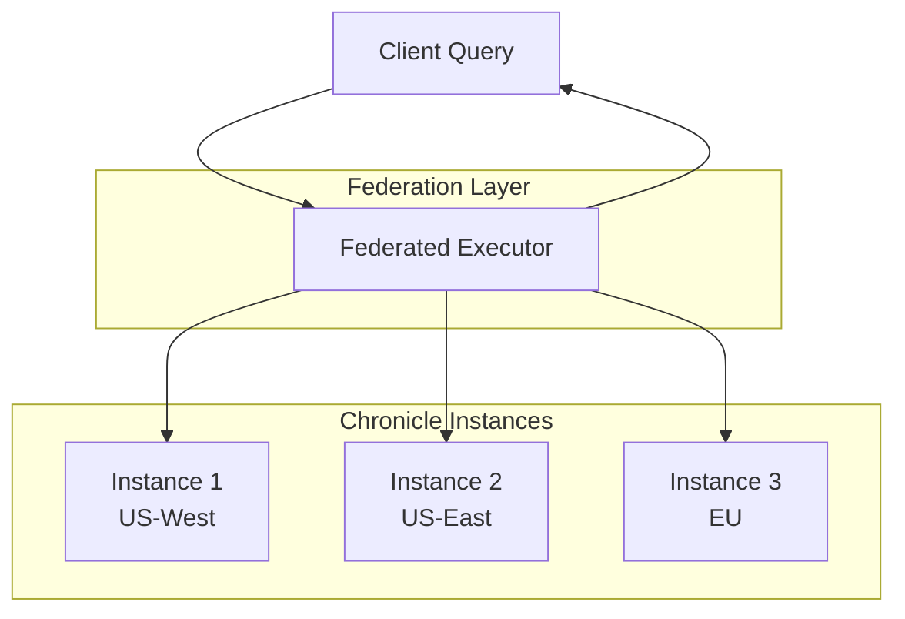
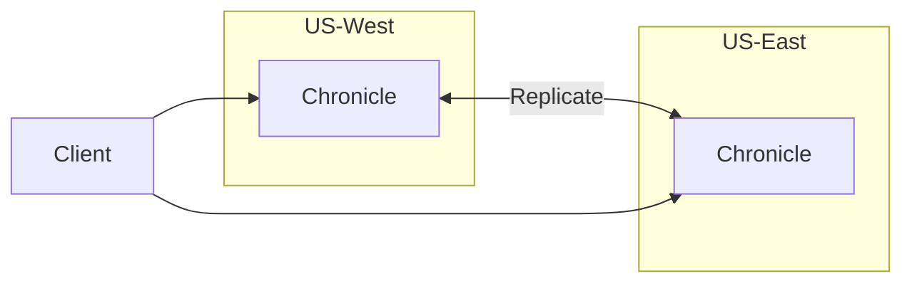
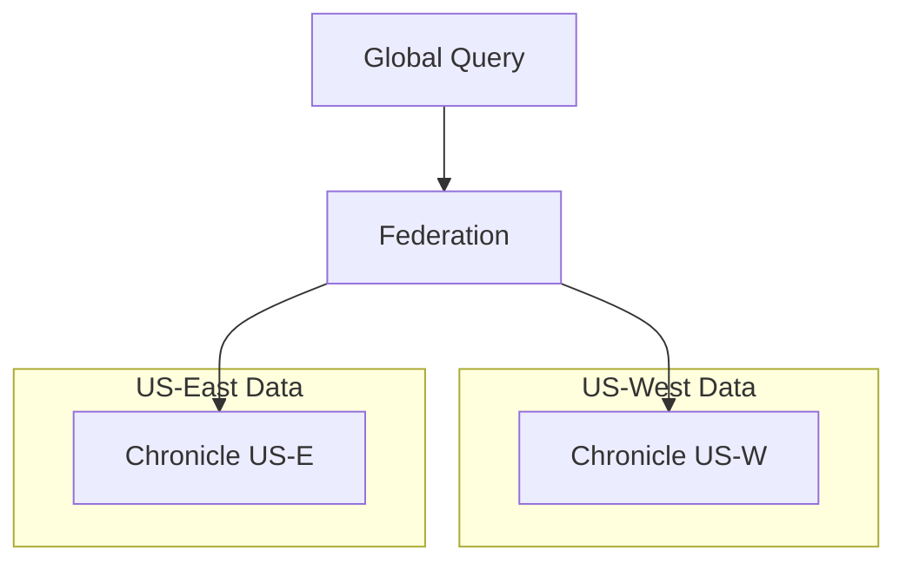
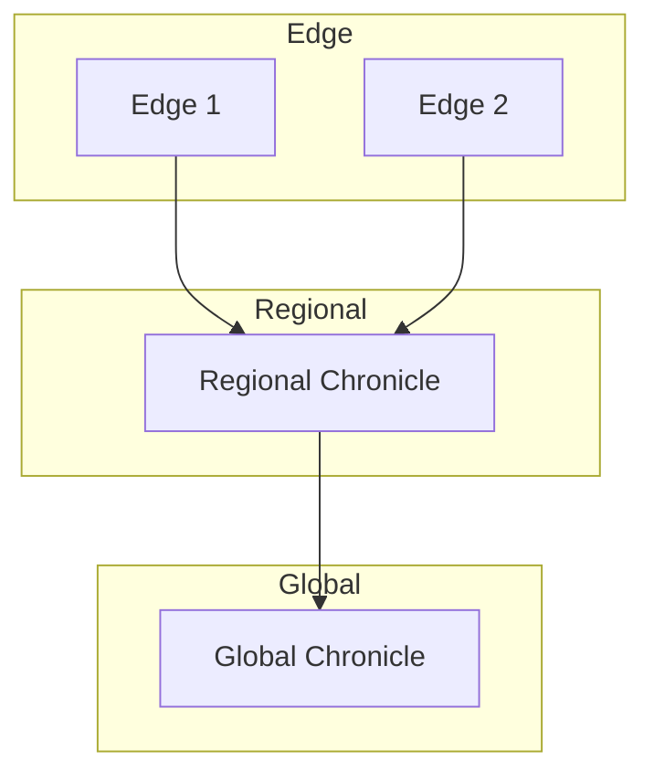

# Query Federation

Federation allows querying across multiple Chronicle instances, enabling distributed deployments and global views.

## Overview



## Setting Up Federation

### Configure Federated Executor

```go
fed := chronicle.NewFederatedExecutor(chronicle.FederationConfig{
    Timeout:     30 * time.Second,
    MaxParallel: 10,
    
    Endpoints: []chronicle.FederationEndpoint{
        {
            Name:    "us-west",
            URL:     "http://chronicle-usw.example.com:8086",
            Headers: map[string]string{"Authorization": "Bearer token1"},
        },
        {
            Name:    "us-east",
            URL:     "http://chronicle-use.example.com:8086",
            Headers: map[string]string{"Authorization": "Bearer token2"},
        },
        {
            Name:    "eu-west",
            URL:     "http://chronicle-euw.example.com:8086",
            Headers: map[string]string{"Authorization": "Bearer token3"},
        },
    },
})
```

### Include Local Instance

```go
fed := chronicle.NewFederatedExecutor(chronicle.FederationConfig{
    LocalDB: db,  // Include local data
    Endpoints: []chronicle.FederationEndpoint{
        // Remote instances...
    },
})
```

## Federated Queries

### Query All Instances

```go
result, err := fed.Query(context.Background(), &chronicle.Query{
    Metric: "cpu_usage",
    Start:  time.Now().Add(-time.Hour).UnixNano(),
    End:    time.Now().UnixNano(),
})

for _, p := range result.Points {
    // Points from all instances
    fmt.Printf("[%s] %s: %.2f\n", p.Tags["__instance__"], p.Metric, p.Value)
}
```

### Query Specific Instances

```go
result, err := fed.Query(context.Background(), &chronicle.Query{
    Metric: "cpu_usage",
    Tags:   map[string]string{"__instance__": "us-west"},
})
```

### Aggregated Queries

```go
// Sum across all instances
result, err := fed.Query(context.Background(), &chronicle.Query{
    Metric: "http_requests_total",
    Aggregation: &chronicle.Aggregation{
        Function: chronicle.AggSum,
        Window:   time.Hour,
    },
})
```

## PromQL Federation

```go
// Federated PromQL
executor := chronicle.NewFederatedPromQL(fed)

result, err := executor.Query(
    `sum by (region) (rate(http_requests_total[5m]))`,
    time.Now(),
)
```

## HTTP Federation

Query via HTTP with federation enabled:

```bash
# Query all instances
curl -X POST http://localhost:8086/federated/query \
  -H "Content-Type: application/json" \
  -d '{
    "metric": "cpu_usage",
    "start": 1706400000000000000,
    "end": 1706486400000000000
  }'

# PromQL across instances
curl "http://localhost:8086/federated/api/v1/query?\
query=sum(rate(http_requests_total[5m]))"
```

## Architecture Patterns

### Global View

All instances have all data; federation provides redundancy:



### Regional Sharding

Each instance holds regional data; federation provides global queries:



### Hierarchical

Edge instances report to regional; regional to global:



## Error Handling

Federation handles partial failures gracefully:

```go
result, err := fed.Query(context.Background(), query)
if err != nil {
    // Check for partial success
    if partialErr, ok := err.(*chronicle.PartialError); ok {
        fmt.Printf("Got results from %d/%d instances\n", 
            partialErr.Succeeded, partialErr.Total)
        
        for _, e := range partialErr.Errors {
            fmt.Printf("  %s: %v\n", e.Instance, e.Error)
        }
        
        // Still have partial results
        for _, p := range result.Points {
            fmt.Println(p)
        }
    }
}
```

### Timeout Handling

```go
ctx, cancel := context.WithTimeout(context.Background(), 10*time.Second)
defer cancel()

result, err := fed.Query(ctx, query)
if err == context.DeadlineExceeded {
    // Some instances didn't respond in time
}
```

## Performance

### Query Routing

Optimize by routing queries to relevant instances:

```go
fed := chronicle.NewFederatedExecutor(chronicle.FederationConfig{
    Router: func(query *chronicle.Query) []string {
        // Route based on tags
        if region, ok := query.Tags["region"]; ok {
            return []string{region}
        }
        // Query all by default
        return nil
    },
})
```

### Result Caching

```go
fed := chronicle.NewFederatedExecutor(chronicle.FederationConfig{
    CacheEnabled: true,
    CacheTTL:     time.Minute,
    CacheMaxSize: 1000,
})
```

### Connection Pooling

```go
fed := chronicle.NewFederatedExecutor(chronicle.FederationConfig{
    HTTPClient: &http.Client{
        Transport: &http.Transport{
            MaxIdleConnsPerHost: 10,
            IdleConnTimeout:     90 * time.Second,
        },
    },
})
```

## Monitoring

Track federation health:

```go
stats := fed.Stats()
for instance, s := range stats.Instances {
    fmt.Printf("%s: %d queries, %v avg latency, %d errors\n",
        instance, s.Queries, s.AvgLatency, s.Errors)
}
```

## Best Practices

1. **Set appropriate timeouts** - Account for network latency
2. **Handle partial failures** - Don't fail entirely if one instance is down
3. **Use query routing** - Avoid querying all instances when not needed
4. **Monitor instance health** - Track latency and error rates
5. **Consider data locality** - Place federation layer near users
