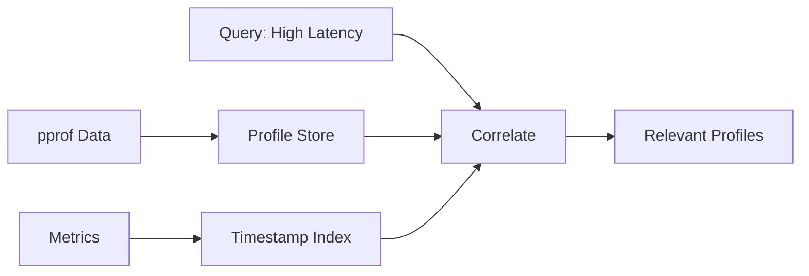

# Continuous Profiling

Chronicle includes continuous profiling capabilities to correlate performance profiles with metrics.

## Overview

Continuous profiling captures:
- CPU profiles
- Memory allocation profiles  
- Goroutine profiles
- Block/mutex contention profiles

Combined with metrics, you can answer questions like:
- "What was consuming CPU when the latency spiked?"
- "Which function was allocating memory when we ran out?"



## Setting Up Profiling

### Enable Profile Collection

```go
profiler := chronicle.NewProfileStore(db, chronicle.ProfileConfig{
    Enabled:         true,
    SampleInterval:  10 * time.Second,
    RetentionPeriod: 24 * time.Hour,
    ProfileTypes:    []string{"cpu", "heap", "goroutine"},
})

profiler.Start()
defer profiler.Stop()
```

### Configuration Options

```go
type ProfileConfig struct {
    // Enable profiling
    Enabled bool
    
    // How often to capture profiles
    SampleInterval time.Duration
    
    // How long to keep profiles
    RetentionPeriod time.Duration
    
    // Which profile types to capture
    ProfileTypes []string  // cpu, heap, allocs, goroutine, block, mutex
    
    // CPU profile duration
    CPUProfileDuration time.Duration
    
    // Labels to attach to all profiles
    Labels map[string]string
}
```

## Storing Profiles

### Automatic Collection

With automatic collection enabled, profiles are captured periodically:

```go
profiler := chronicle.NewProfileStore(db, chronicle.ProfileConfig{
    Enabled:        true,
    SampleInterval: 10 * time.Second,
    ProfileTypes:   []string{"cpu", "heap"},
})
profiler.Start()
```

### Manual Capture

Capture profiles on-demand:

```go
// Capture CPU profile
cpuProfile, err := profiler.CaptureCPU(30 * time.Second)

// Capture heap profile
heapProfile, err := profiler.CaptureHeap()

// Capture with custom labels
profile, err := profiler.Capture(chronicle.CaptureOptions{
    Type:   "cpu",
    Labels: map[string]string{"request_id": "abc123"},
})
```

### Store External Profiles

Import profiles from other sources:

```go
// From pprof data
pprofData, _ := os.ReadFile("cpu.pprof")
profiler.Store(chronicle.ProfileData{
    Type:      "cpu",
    Data:      pprofData,
    Timestamp: time.Now().UnixNano(),
    Labels:    map[string]string{"source": "external"},
})
```

## Querying Profiles

### By Time Range

```go
profiles, err := profiler.Query(chronicle.ProfileQuery{
    Start: time.Now().Add(-time.Hour).UnixNano(),
    End:   time.Now().UnixNano(),
    Type:  "cpu",
})

for _, p := range profiles {
    fmt.Printf("Profile at %v: %d bytes\n", 
        time.Unix(0, p.Timestamp), len(p.Data))
}
```

### By Metric Condition

Find profiles when a metric condition was true:

```go
// Get profiles when CPU was high
profiles, err := profiler.QueryByMetricCondition(chronicle.MetricCondition{
    Metric:   "cpu_usage",
    Operator: ">",
    Value:    90,
})
```

### Correlation Query

```go
// When was latency high?
highLatencyTimes, _ := db.Execute(&chronicle.Query{
    Metric: "request_latency_p99",
    TagFilters: []chronicle.TagFilter{
        {Key: "value", Op: chronicle.TagOpGt, Values: []string{"1.0"}},
    },
})

// Get CPU profiles from those times
for _, p := range highLatencyTimes.Points {
    profiles, _ := profiler.Query(chronicle.ProfileQuery{
        Start: p.Timestamp - int64(time.Minute),
        End:   p.Timestamp + int64(time.Minute),
        Type:  "cpu",
    })
    
    for _, prof := range profiles {
        analyzeProfile(prof)
    }
}
```

## Analyzing Profiles

### Export to pprof

```go
profile, _ := profiler.Get(profileID)

// Write to file for go tool pprof
os.WriteFile("profile.pprof", profile.Data, 0644)

// Then: go tool pprof profile.pprof
```

### Flamegraph Generation

```go
// Generate flamegraph SVG
svg, err := profile.Flamegraph()
os.WriteFile("flamegraph.svg", svg, 0644)
```

### Top Functions

```go
// Get top CPU consumers
analysis := profile.Analyze()
for _, f := range analysis.TopFunctions[:10] {
    fmt.Printf("%s: %.2f%%\n", f.Name, f.Percentage)
}
```

## HTTP Endpoints

### Get Current Profile

```bash
# CPU profile (30 seconds)
curl "http://localhost:8086/debug/pprof/profile?seconds=30" > cpu.pprof

# Heap profile
curl "http://localhost:8086/debug/pprof/heap" > heap.pprof

# Goroutine profile
curl "http://localhost:8086/debug/pprof/goroutine" > goroutine.pprof
```

### Query Stored Profiles

```bash
# List profiles
curl "http://localhost:8086/profiles?start=2024-01-28T00:00:00Z&end=2024-01-28T12:00:00Z&type=cpu"

# Get specific profile
curl "http://localhost:8086/profiles/prof-123" > profile.pprof
```

## Integration with Observability Tools

### Grafana Pyroscope

```go
profiler := chronicle.NewProfileStore(db, chronicle.ProfileConfig{
    ExportToPyroscope: true,
    PyroscopeURL:      "http://pyroscope:4040",
    PyroscopeApp:      "chronicle",
})
```

### Continuous Profiler Services

Export profiles to cloud profiling services:

```go
profiler := chronicle.NewProfileStore(db, chronicle.ProfileConfig{
    ExportEndpoint: "https://profiling.example.com/v1/profiles",
    ExportHeaders:  map[string]string{"Authorization": "Bearer token"},
})
```

## Best Practices

1. **Sample appropriately** - 10-60 seconds between samples
2. **Keep retention reasonable** - 24-48 hours of profiles
3. **Label profiles** - Add context (deployment, version, request)
4. **Automate correlation** - Set up alerts that include profile links
5. **Don't profile continuously in production** - Sample instead

## Example: Incident Investigation

```go
// Alert: High latency detected
func investigateLatency(alertTime time.Time) {
    // Get profiles around the incident
    profiles, _ := profiler.Query(chronicle.ProfileQuery{
        Start: alertTime.Add(-5 * time.Minute).UnixNano(),
        End:   alertTime.Add(5 * time.Minute).UnixNano(),
        Type:  "cpu",
    })
    
    // Find the hottest functions
    for _, p := range profiles {
        analysis := p.Analyze()
        
        fmt.Printf("Profile at %v:\n", time.Unix(0, p.Timestamp))
        for _, f := range analysis.TopFunctions[:5] {
            fmt.Printf("  %s: %.2f%%\n", f.Name, f.Percentage)
        }
    }
    
    // Get memory profiles too
    heapProfiles, _ := profiler.Query(chronicle.ProfileQuery{
        Start: alertTime.Add(-5 * time.Minute).UnixNano(),
        End:   alertTime.Add(5 * time.Minute).UnixNano(),
        Type:  "heap",
    })
    
    // Check for memory pressure
    for _, p := range heapProfiles {
        analysis := p.Analyze()
        fmt.Printf("Heap at %v: %d MB in use\n", 
            time.Unix(0, p.Timestamp), 
            analysis.InUseBytes/1024/1024)
    }
}
