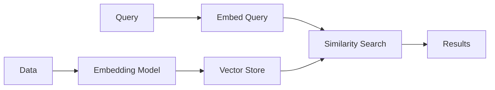

# Vector Embeddings

Chronicle supports storing and searching vector embeddings, enabling semantic search and ML-powered analytics on time-series data.

## Overview

Vector embeddings allow you to:
- Store high-dimensional vectors alongside metrics
- Find similar patterns using k-NN search
- Build semantic search for log messages
- Power anomaly detection with ML models



## Creating a Vector Store

```go
store := chronicle.NewVectorStore(db, chronicle.VectorConfig{
    Dimensions:     384,        // Embedding dimensions
    DistanceMetric: chronicle.Cosine,  // Similarity metric
    MaxVectors:     1_000_000,  // Capacity
})
```

### Distance Metrics

| Metric | Use Case | Range |
|--------|----------|-------|
| `Cosine` | Text embeddings, normalized vectors | 0-2 |
| `Euclidean` | Spatial data, raw features | 0-∞ |
| `DotProduct` | Pre-normalized vectors, recommendations | -∞-∞ |

## Storing Vectors

### Basic Storage

```go
// Store a single vector
err := store.Insert(chronicle.VectorPoint{
    ID:        "doc-123",
    Vector:    []float32{0.1, 0.2, ...},  // 384 dimensions
    Metadata:  map[string]string{"type": "error", "service": "api"},
    Timestamp: time.Now().UnixNano(),
})
```

### Batch Insert

```go
points := []chronicle.VectorPoint{
    {ID: "v1", Vector: embedding1, Metadata: meta1},
    {ID: "v2", Vector: embedding2, Metadata: meta2},
    {ID: "v3", Vector: embedding3, Metadata: meta3},
}

err := store.InsertBatch(points)
```

### With Embedding Generation

```go
// Using an embedding model
embedder := NewOpenAIEmbedder(apiKey)

text := "Error: connection timeout to database"
vector, _ := embedder.Embed(text)

store.Insert(chronicle.VectorPoint{
    ID:       "log-456",
    Vector:   vector,
    Metadata: map[string]string{"message": text},
})
```

## Searching Vectors

### k-Nearest Neighbors (k-NN)

```go
// Find 10 most similar vectors
results, err := store.Search(chronicle.VectorQuery{
    Vector: queryVector,
    K:      10,
})

for _, r := range results {
    fmt.Printf("ID: %s, Distance: %.4f\n", r.ID, r.Distance)
    fmt.Printf("  Metadata: %v\n", r.Metadata)
}
```

### With Filters

```go
// k-NN with metadata filters
results, _ := store.Search(chronicle.VectorQuery{
    Vector: queryVector,
    K:      10,
    Filters: map[string]string{
        "service": "api",
        "level":   "error",
    },
})
```

### Time Range

```go
// Search within time range
results, _ := store.Search(chronicle.VectorQuery{
    Vector: queryVector,
    K:      10,
    Start:  time.Now().Add(-time.Hour).UnixNano(),
    End:    time.Now().UnixNano(),
})
```

## Use Cases

### Semantic Log Search

```go
// Index log messages
for _, log := range logs {
    vector, _ := embedder.Embed(log.Message)
    store.Insert(chronicle.VectorPoint{
        ID:        log.ID,
        Vector:    vector,
        Metadata:  map[string]string{"level": log.Level, "service": log.Service},
        Timestamp: log.Timestamp,
    })
}

// Search for similar errors
queryVector, _ := embedder.Embed("database connection failed")
results, _ := store.Search(chronicle.VectorQuery{
    Vector:  queryVector,
    K:       20,
    Filters: map[string]string{"level": "error"},
})
```

### Anomaly Detection

```go
// Store pattern embeddings
for _, window := range timeWindows {
    features := extractFeatures(window.Metrics)
    vector := featureToVector(features)
    
    store.Insert(chronicle.VectorPoint{
        ID:        fmt.Sprintf("window-%d", window.Start),
        Vector:    vector,
        Metadata:  map[string]string{"normal": "true"},
        Timestamp: window.Start,
    })
}

// Check new data for anomalies
currentFeatures := extractFeatures(currentMetrics)
currentVector := featureToVector(currentFeatures)

results, _ := store.Search(chronicle.VectorQuery{
    Vector: currentVector,
    K:      5,
})

// If no similar patterns found, likely anomaly
avgDistance := averageDistance(results)
if avgDistance > threshold {
    alert("Anomaly detected: no similar historical patterns")
}
```

### Similar Metric Discovery

```go
// Find metrics with similar behavior
metricEmbedding := embedMetricPattern("cpu_usage", lastHour)

results, _ := store.Search(chronicle.VectorQuery{
    Vector: metricEmbedding,
    K:      10,
})

fmt.Println("Metrics with similar patterns:")
for _, r := range results {
    fmt.Printf("  %s (distance: %.4f)\n", r.Metadata["metric"], r.Distance)
}
```

## Embedding Models

Chronicle doesn't include embedding models—integrate your own:

### OpenAI

```go
func embedWithOpenAI(text string) ([]float32, error) {
    resp, err := openai.CreateEmbedding(openai.EmbeddingRequest{
        Model: "text-embedding-ada-002",
        Input: []string{text},
    })
    return resp.Data[0].Embedding, err
}
```

### Sentence Transformers (Local)

```python
# Python service
from sentence_transformers import SentenceTransformer

model = SentenceTransformer('all-MiniLM-L6-v2')

def embed(text):
    return model.encode(text).tolist()
```

```go
// Call from Go
func embedWithLocal(text string) ([]float32, error) {
    resp, err := http.Post("http://localhost:5000/embed",
        "application/json",
        strings.NewReader(fmt.Sprintf(`{"text": %q}`, text)))
    // Parse response...
}
```

## Performance

### Indexing

For large vector stores, consider:

```go
store := chronicle.NewVectorStore(db, chronicle.VectorConfig{
    Dimensions:     384,
    DistanceMetric: chronicle.Cosine,
    IndexType:      chronicle.VectorIndexHNSW,
    HNSWConfig: &chronicle.HNSWConfig{
        M:              16,   // Max connections per node
        EfConstruction: 200,  // Build-time search depth
        EfSearch:       50,   // Query-time search depth
    },
})
```

### Batch Operations

```go
// Batch insert for better performance
const batchSize = 1000
for i := 0; i < len(points); i += batchSize {
    end := min(i+batchSize, len(points))
    store.InsertBatch(points[i:end])
}
```

## API Reference

### VectorStore Methods

```go
// Insert a single vector
func (s *VectorStore) Insert(p VectorPoint) error

// Insert multiple vectors
func (s *VectorStore) InsertBatch(points []VectorPoint) error

// Search for similar vectors
func (s *VectorStore) Search(q VectorQuery) ([]VectorResult, error)

// Delete a vector
func (s *VectorStore) Delete(id string) error

// Get vector by ID
func (s *VectorStore) Get(id string) (*VectorPoint, error)

// Count vectors
func (s *VectorStore) Count() int64
```

### Types

```go
type VectorPoint struct {
    ID        string
    Vector    []float32
    Metadata  map[string]string
    Timestamp int64
}

type VectorQuery struct {
    Vector  []float32
    K       int
    Filters map[string]string
    Start   int64
    End     int64
}

type VectorResult struct {
    ID       string
    Distance float32
    Metadata map[string]string
}
```
