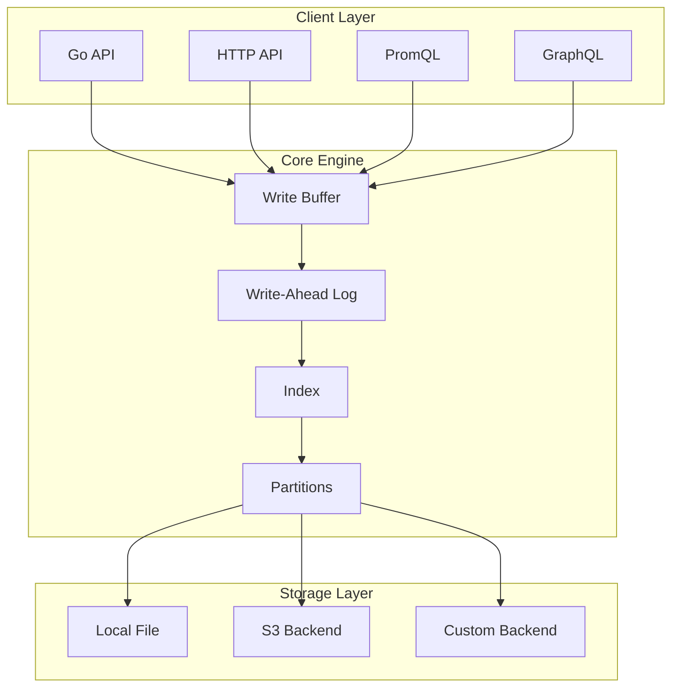
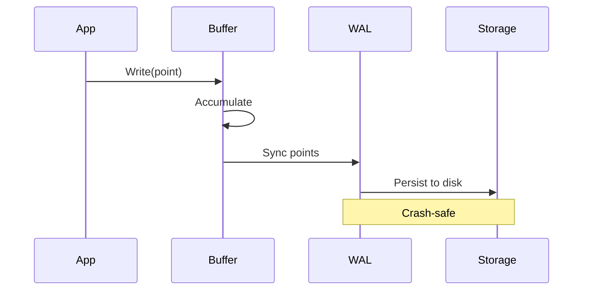
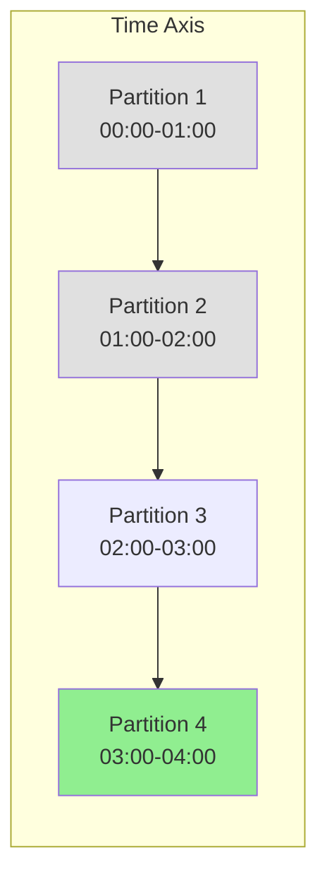
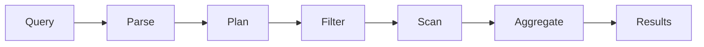
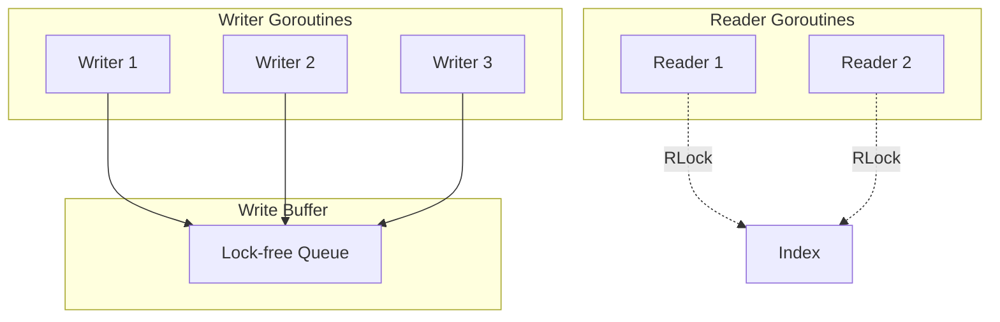

# Architecture

Chronicle is designed as an embedded time-series database optimized for Go applications. This page explains the key architectural components and how they work together.

## High-Level Overview



## Core Components

### Write Buffer

The write buffer batches incoming points before persisting them:

- **Purpose**: Reduces disk I/O by batching small writes
- **Default size**: 10,000 points
- **Behavior**: Automatically flushes when full or on `db.Flush()`
- **Thread-safe**: Multiple goroutines can write concurrently

```go
// Points are buffered automatically
db.Write(point)  // Adds to buffer

// Explicit flush when needed
db.Flush()  // Writes buffer to disk
```

### Write-Ahead Log (WAL)

The WAL ensures durability and crash recovery:

- **Purpose**: Guarantees no data loss on crash
- **Sync interval**: Configurable (default: 1 second)
- **Rotation**: Rotates at configurable size (default: 128MB)
- **Recovery**: Replays uncommitted data on startup



### Index

The index provides fast series lookup:

- **Series registry**: Maps metric+tags → series ID
- **Partition index**: Maps time ranges → partitions
- **Tag index**: Enables efficient tag filtering
- **Memory-resident**: Loaded on startup, persisted on close

### Partitions

Data is organized into time-based partitions:

- **Time-based**: Each partition covers a time window (default: 1 hour)
- **Benefits**: Enables efficient retention, parallel queries, compaction
- **Lazy loading**: Partitions load data on demand
- **Compression**: Gorilla + Snappy encoding



## Data Flow

### Write Path

1. **Receive**: Point arrives via Go API or HTTP
2. **Validate**: Schema validation (if configured)
3. **Track**: Cardinality tracking
4. **Buffer**: Add to write buffer
5. **WAL**: Write to WAL (sync interval)
6. **Flush**: Write to partition when buffer full
7. **Index**: Update series and tag indexes

### Query Path

1. **Parse**: Parse SQL/PromQL query
2. **Plan**: Determine partitions and series
3. **Filter**: Apply tag filters using index
4. **Scan**: Read matching points from partitions
5. **Aggregate**: Apply aggregation functions
6. **Return**: Return results to caller



## Storage Engine

### Compression

Chronicle uses a two-stage compression approach:

1. **Gorilla encoding**: Delta-of-delta for timestamps, XOR for values
2. **Snappy compression**: Fast block compression

Typical compression ratios: **10-15x** for metrics data.

### File Format

```
┌─────────────────────────────┐
│         File Header         │
├─────────────────────────────┤
│        Partition 1          │
│  ┌───────────────────────┐  │
│  │ Series 1 (compressed) │  │
│  │ Series 2 (compressed) │  │
│  │ ...                   │  │
│  └───────────────────────┘  │
├─────────────────────────────┤
│        Partition 2          │
│  ┌───────────────────────┐  │
│  │ Series 1 (compressed) │  │
│  │ ...                   │  │
│  └───────────────────────┘  │
├─────────────────────────────┤
│           Index             │
├─────────────────────────────┤
│         File Footer         │
└─────────────────────────────┘
```

## Background Processes

Chronicle runs several background goroutines:

| Process | Interval | Purpose |
|---------|----------|---------|
| WAL Sync | 1s (configurable) | Durability |
| Retention | 5 min | Delete expired data |
| Downsampling | 5 min | Create rollups |
| Compaction | 30 min (configurable) | Reclaim space |

## Memory Management

Chronicle carefully manages memory:

- **MaxMemory**: Total budget for buffers and caches
- **Query limits**: Per-query memory cap
- **Buffer sizing**: Automatic based on MaxMemory
- **Partition caching**: LRU eviction

```go
db, _ := chronicle.Open("data.db", chronicle.Config{
    MaxMemory: 256 * 1024 * 1024,  // 256MB total
    BufferSize: 50_000,             // 50k point buffer
})
```

## Concurrency Model

Chronicle is fully thread-safe:

- **Writes**: Lock-free buffer with mutex on flush
- **Reads**: RWMutex allows concurrent queries
- **Background**: Separate goroutines for maintenance
- **No global locks**: Partition-level locking



## Extension Points

Chronicle is designed for extensibility:

### Storage Backends

Implement `StorageBackend` for custom storage:

```go
type StorageBackend interface {
    Read(ctx context.Context, key string) (io.ReadCloser, error)
    Write(ctx context.Context, key string, data io.Reader) error
    Delete(ctx context.Context, key string) error
    List(ctx context.Context, prefix string) ([]string, error)
}
```

### Query Languages

- Native Go API
- SQL-like parser
- PromQL executor
- GraphQL schema

## What's Next?

- [Data Model](/docs/core-concepts/data-model) - Metrics, tags, and series
- [Storage](/docs/core-concepts/storage) - Storage engine details
- [Storage Backends](/docs/advanced/storage-backends) - S3 and custom backends
