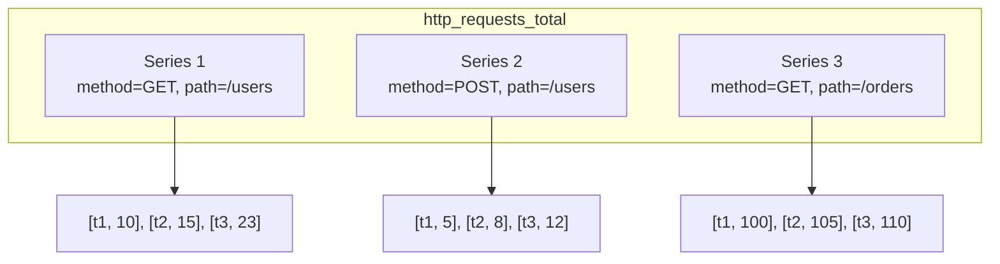

# Data Model

Chronicle uses a dimensional data model similar to Prometheus and InfluxDB. Understanding this model is essential for effective time-series storage and querying.

## Core Concepts

### Points

A **Point** is the fundamental unit of data:

```go
type Point struct {
    Metric    string            // Name of the measurement
    Tags      map[string]string // Dimensional labels
    Value     float64           // The numeric value
    Timestamp int64             // Unix nanoseconds
}
```

Example point:

```go
chronicle.Point{
    Metric:    "http_requests_total",
    Tags:      map[string]string{
        "method": "GET",
        "path":   "/api/users",
        "status": "200",
    },
    Value:     1523,
    Timestamp: 1706400000000000000,
}
```

### Metrics

A **Metric** is the name that identifies what you're measuring:

```
cpu_usage
memory_bytes_used
http_requests_total
disk_io_operations
temperature_celsius
```

**Naming conventions:**
- Use snake_case: `http_requests_total`
- Be specific: `process_cpu_seconds_total` not `cpu`
- Include units: `request_duration_seconds`, `memory_bytes`
- Use `_total` suffix for counters

### Tags

**Tags** are key-value pairs that add dimensions to your data:

```go
Tags: map[string]string{
    "host":     "server-01",
    "region":   "us-west-2",
    "env":      "production",
    "service":  "api-gateway",
}
```

Tags enable:
- **Filtering**: Query data for specific hosts, regions, etc.
- **Grouping**: Aggregate by tag values
- **Cardinality**: Each unique tag combination creates a new series

**Tag guidelines:**
- Keep tag values low-cardinality (avoid UUIDs, timestamps)
- Use consistent naming: `host` not sometimes `hostname`
- Limit to 10-15 tags per metric

### Series

A **Series** is a unique combination of metric name and tag set:

```
http_requests_total{method="GET", path="/api/users", status="200"}
http_requests_total{method="GET", path="/api/users", status="500"}
http_requests_total{method="POST", path="/api/users", status="201"}
```

Each series has a unique ID and stores its own timeline of values.



## Data Types

### Metric Types

Chronicle supports several metric patterns:

#### Gauges
Point-in-time values that can go up or down:

```go
// Current CPU usage
db.Write(chronicle.Point{
    Metric: "cpu_usage_percent",
    Tags:   map[string]string{"host": "server-01"},
    Value:  45.2,
})

// Current temperature
db.Write(chronicle.Point{
    Metric: "temperature_celsius",
    Tags:   map[string]string{"sensor": "room-1"},
    Value:  22.5,
})
```

#### Counters
Monotonically increasing values:

```go
// Total requests (always increases)
db.Write(chronicle.Point{
    Metric: "http_requests_total",
    Tags:   map[string]string{"method": "GET"},
    Value:  150234,
})
```

Query counters with `rate()` to get per-second rates:

```go
executor.Query(`rate(http_requests_total[5m])`, time.Now())
```

#### Histograms

Native histogram support for distribution data:

```go
db.WriteHistogram(chronicle.HistogramPoint{
    Metric:    "request_duration_seconds",
    Tags:      map[string]string{"endpoint": "/api"},
    Timestamp: time.Now().UnixNano(),
    Buckets: []chronicle.HistogramBucket{
        {UpperBound: 0.01, Count: 150},
        {UpperBound: 0.05, Count: 450},
        {UpperBound: 0.1, Count: 520},
        {UpperBound: 0.5, Count: 580},
        {UpperBound: 1.0, Count: 590},
        {UpperBound: math.Inf(1), Count: 600},
    },
    Sum:   45.2,
    Count: 600,
})
```

## Timestamps

Chronicle uses **Unix nanoseconds** for maximum precision:

```go
// Current time
timestamp := time.Now().UnixNano()

// Specific time
t := time.Date(2024, 1, 15, 10, 30, 0, 0, time.UTC)
timestamp := t.UnixNano()

// From seconds
timestamp := time.Unix(1706400000, 0).UnixNano()
```

If you don't provide a timestamp, Chronicle uses the current time:

```go
// Timestamp auto-set to now
db.Write(chronicle.Point{
    Metric: "cpu_usage",
    Value:  45.2,
})
```

## Cardinality

**Cardinality** is the total number of unique series in your database.

```
High cardinality = Many unique tag combinations = More memory/storage
```

### Cardinality Explosion

Avoid high-cardinality tags:

```go
// ❌ BAD: user_id creates millions of series
Tags: map[string]string{
    "user_id": "550e8400-e29b-41d4-a716-446655440000",
}

// ❌ BAD: request_id is unique per request
Tags: map[string]string{
    "request_id": "req-12345",
}

// ✅ GOOD: Limited set of values
Tags: map[string]string{
    "status_code": "200",  // ~10 values
    "method":      "GET",  // ~5 values
    "region":      "us-west-2",  // ~20 values
}
```

### Cardinality Tracking

Chronicle tracks cardinality automatically:

```go
stats := db.CardinalityStats()
fmt.Printf("Total series: %d\n", stats.TotalSeries)
fmt.Printf("Active series: %d\n", stats.ActiveSeries)
```

Configure limits to prevent explosion:

```go
tracker := chronicle.NewCardinalityTracker(db, chronicle.CardinalityConfig{
    MaxTotalSeries:     1_000_000,
    MaxSeriesPerMetric: 100_000,
    WarnThreshold:      0.8,  // Warn at 80%
})
```

## Schema Validation

Define schemas to enforce data quality:

```go
db.RegisterSchema(chronicle.MetricSchema{
    Name:        "cpu_usage",
    Description: "CPU utilization percentage",
    Type:        chronicle.SchemaTypeGauge,
    Unit:        "percent",
    Min:         ptr(0.0),
    Max:         ptr(100.0),
    RequiredTags: []string{"host"},
    OptionalTags: []string{"cpu", "mode"},
})

// This will fail validation
db.Write(chronicle.Point{
    Metric: "cpu_usage",
    Value:  150.0,  // Error: exceeds max of 100
})
```

## Best Practices

### Metric Naming

| Pattern | Example | Use Case |
|---------|---------|----------|
| `noun_unit` | `temperature_celsius` | Gauges |
| `noun_unit_total` | `requests_bytes_total` | Counters |
| `noun_action_unit` | `http_request_duration_seconds` | Histograms |

### Tag Guidelines

1. **Keep cardinality bounded**: Use enumerable values
2. **Be consistent**: Same tag names across metrics
3. **Use hierarchy**: `region` → `zone` → `host`
4. **Avoid redundancy**: Don't repeat metric name in tags

### Storage Efficiency

```go
// ❌ Inefficient: One metric per type
db.Write(Point{Metric: "server01_cpu", Value: 45.2})
db.Write(Point{Metric: "server02_cpu", Value: 32.1})

// ✅ Efficient: Use tags for dimensions
db.Write(Point{Metric: "cpu", Tags: map[string]string{"host": "server01"}, Value: 45.2})
db.Write(Point{Metric: "cpu", Tags: map[string]string{"host": "server02"}, Value: 32.1})
```

## What's Next?

- [Storage](/docs/core-concepts/storage) - How data is stored
- [Queries](/docs/core-concepts/queries) - Query capabilities
- [Retention](/docs/core-concepts/retention) - Data lifecycle
