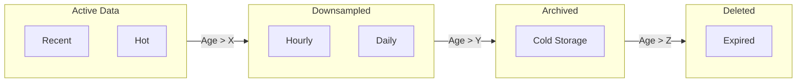
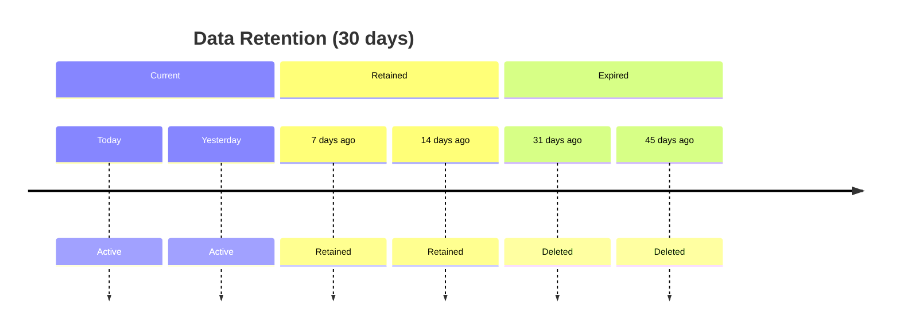
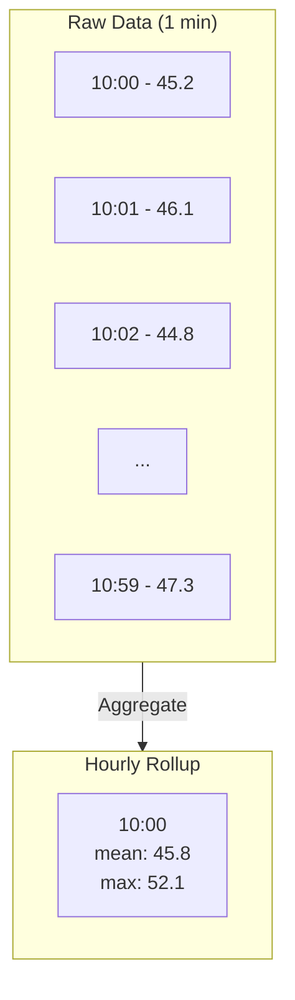

# Retention

Chronicle provides flexible retention policies to manage data lifecycle, balancing storage costs with data availability.

## Retention Overview



## Time-Based Retention

Delete data older than a specified duration:

```go
db, _ := chronicle.Open("data.db", chronicle.Config{
    RetentionDuration: 30 * 24 * time.Hour,  // Keep 30 days
})
```

### How It Works

1. Background worker runs every 5 minutes
2. Identifies partitions entirely before cutoff time
3. Marks partitions for deletion
4. Compaction reclaims disk space



## Size-Based Retention

Limit total database size:

```go
db, _ := chronicle.Open("data.db", chronicle.Config{
    MaxStorageBytes: 10 * 1024 * 1024 * 1024,  // 10GB max
})
```

When the limit is exceeded:
1. Oldest partitions are removed first
2. Process continues until under limit
3. Compaction runs to free space

### Combined Retention

Use both time and size limits:

```go
db, _ := chronicle.Open("data.db", chronicle.Config{
    RetentionDuration: 90 * 24 * time.Hour,  // 90 days max
    MaxStorageBytes:   50 * 1024 * 1024 * 1024, // 50GB max
})
```

Data is deleted when **either** condition is met.

## Downsampling

Preserve long-term trends while reducing storage:

```go
db, _ := chronicle.Open("data.db", chronicle.Config{
    RetentionDuration: 7 * 24 * time.Hour,  // Raw data: 7 days
    DownsampleRules: []chronicle.DownsampleRule{
        {
            SourceResolution: time.Minute,
            TargetResolution: time.Hour,
            Aggregations:     []chronicle.AggFunc{chronicle.AggMean, chronicle.AggMax},
            Retention:        90 * 24 * time.Hour,  // Hourly: 90 days
        },
        {
            SourceResolution: time.Hour,
            TargetResolution: 24 * time.Hour,
            Aggregations:     []chronicle.AggFunc{chronicle.AggMean, chronicle.AggMax},
            Retention:        365 * 24 * time.Hour,  // Daily: 1 year
        },
    },
})
```

### Downsample Rule Structure

```go
type DownsampleRule struct {
    SourceResolution time.Duration   // Source data interval
    TargetResolution time.Duration   // Target rollup interval
    Aggregations     []AggFunc       // Functions to apply
    Retention        time.Duration   // How long to keep rollups
}
```

### How Downsampling Works



### Querying Downsampled Data

Downsampled metrics have a naming convention:

```
{original_metric}:{resolution}:{aggregation}
```

Example:
- Raw: `cpu_usage`
- Hourly mean: `cpu_usage:1h0m0s:mean`
- Daily max: `cpu_usage:24h0m0s:max`

Query downsampled data:

```go
// Query hourly averages
result, _ := db.Execute(&chronicle.Query{
    Metric: "cpu_usage:1h0m0s:mean",
    Start:  time.Now().Add(-30 * 24 * time.Hour).UnixNano(),
    End:    time.Now().UnixNano(),
})
```

## Continuous Queries

Materialize aggregated views in real-time:

```go
db, _ := chronicle.Open("data.db", chronicle.Config{
    ContinuousQueries: []chronicle.ContinuousQuery{
        {
            Name:        "hourly_cpu",
            Query:       "SELECT mean(value) FROM cpu_usage GROUP BY time(1h), host",
            Destination: "cpu_usage_hourly",
            Interval:    time.Hour,
        },
    },
})
```

### Continuous Query Benefits

- **Pre-computed**: Fast queries on aggregated data
- **Automatic**: Runs on schedule, no manual intervention
- **Flexible**: Any valid query can be materialized

## Backup Before Deletion

Export data before retention deletes it:

```go
// Export data about to expire
cutoff := time.Now().Add(-29 * 24 * time.Hour)
exporter := chronicle.NewExporter(db)

file, _ := os.Create("backup.csv")
defer file.Close()

exporter.Export(context.Background(), chronicle.ExportOptions{
    Format: chronicle.ExportCSV,
    Query: &chronicle.Query{
        Start: cutoff.Add(-24 * time.Hour).UnixNano(),
        End:   cutoff.UnixNano(),
    },
    Output: file,
})
```

## Retention Best Practices

### Tiered Retention Strategy

```go
// Example: 3-tier retention
config := chronicle.Config{
    RetentionDuration: 7 * 24 * time.Hour,  // Raw: 7 days
    DownsampleRules: []chronicle.DownsampleRule{
        // Tier 2: 5-minute rollups for 30 days
        {
            SourceResolution: time.Minute,
            TargetResolution: 5 * time.Minute,
            Aggregations:     []chronicle.AggFunc{AggMean, AggMin, AggMax},
            Retention:        30 * 24 * time.Hour,
        },
        // Tier 3: Hourly rollups for 1 year
        {
            SourceResolution: 5 * time.Minute,
            TargetResolution: time.Hour,
            Aggregations:     []chronicle.AggFunc{AggMean, AggMin, AggMax},
            Retention:        365 * 24 * time.Hour,
        },
    },
}
```

### Storage Estimation

Estimate storage needs:

| Resolution | Points/Day/Series | Size/Day/Series |
|------------|-------------------|-----------------|
| 1 second | 86,400 | ~85 KB |
| 1 minute | 1,440 | ~1.4 KB |
| 5 minutes | 288 | ~300 B |
| 1 hour | 24 | ~25 B |

Formula: `Storage = Series × Points/Day × Bytes/Point × Retention Days`

### Choosing Retention Periods

| Use Case | Raw Retention | Rollup Retention |
|----------|---------------|------------------|
| Debugging | 7-14 days | 30-90 days |
| Monitoring | 14-30 days | 90-180 days |
| Capacity planning | 30-90 days | 1-2 years |
| Compliance | As required | As required |

## Monitoring Retention

Check retention status:

```go
stats := db.CardinalityStats()
fmt.Printf("Total series: %d\n", stats.TotalSeries)
fmt.Printf("Active series (24h): %d\n", stats.ActiveSeries)

// Check storage size
info, _ := os.Stat("data.db")
fmt.Printf("Database size: %d MB\n", info.Size()/1024/1024)
```

## What's Next?

- [Backup & Restore](/docs/guides/backup-restore) - Backup strategies
- [Data Model](/docs/core-concepts/data-model) - Understanding cardinality
- [Storage](/docs/core-concepts/storage) - Storage engine details
