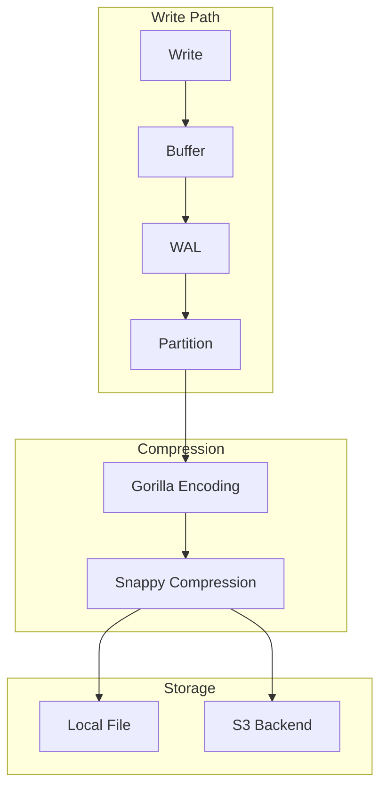
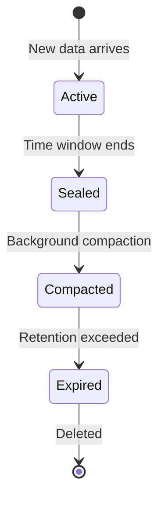
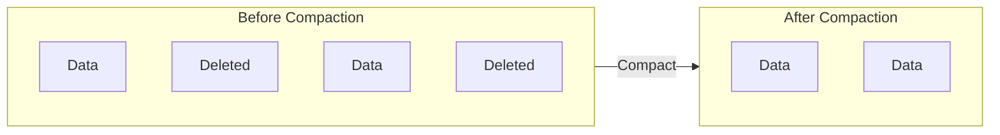

# Storage Engine

Chronicle's storage engine is optimized for time-series data, achieving high compression ratios and fast queries through specialized algorithms.

## Storage Architecture



## Partitions

Data is organized into **time-based partitions**, each covering a configurable time window:

```go
db, _ := chronicle.Open("data.db", chronicle.Config{
    PartitionDuration: time.Hour,  // 1 partition per hour
})
```

### Partition Benefits

| Benefit | Description |
|---------|-------------|
| **Efficient retention** | Delete old data by dropping entire partitions |
| **Parallel queries** | Query multiple partitions concurrently |
| **Better compression** | Similar timestamps compress well together |
| **Reduced I/O** | Only load relevant partitions for queries |

### Partition Lifecycle



## Compression

Chronicle uses a two-stage compression approach inspired by Gorilla (Facebook's TSDB paper):

### Stage 1: Gorilla Encoding

**Timestamps** use delta-of-delta encoding:
- First timestamp: stored as-is (64 bits)
- Subsequent: store difference from previous delta
- Most deltas are 0 or small, requiring only 1-4 bits

**Values** use XOR encoding:
- First value: stored as-is (64 bits)
- Subsequent: XOR with previous value
- Leading/trailing zeros are omitted

```
Timestamps: [1000, 1010, 1020, 1030, 1040]
Deltas:     [1000, 10, 10, 10, 10]
Delta-of-D: [1000, 10, 0, 0, 0]  ← mostly zeros!
```

### Stage 2: Block Compression

After Gorilla encoding, blocks are compressed with **Snappy**:
- Fast compression/decompression
- Reasonable compression ratio
- No memory allocation during decompression

### Compression Ratios

Typical results for metrics data:

| Data Type | Raw Size | Compressed | Ratio |
|-----------|----------|------------|-------|
| Regular metrics (1s interval) | 16 bytes/point | ~1 byte/point | 16:1 |
| Sparse metrics (irregular) | 16 bytes/point | ~2 bytes/point | 8:1 |
| High-variance values | 16 bytes/point | ~3 bytes/point | 5:1 |

## Write-Ahead Log (WAL)

The WAL ensures durability without sacrificing write performance:

```go
db, _ := chronicle.Open("data.db", chronicle.Config{
    SyncInterval: time.Second,      // Sync every second
    WALMaxSize:   128 * 1024 * 1024, // Rotate at 128MB
    WALRetain:    3,                 // Keep 3 old files
})
```

### WAL Operation

1. **Buffer points** in memory
2. **Append to WAL** file (sequential I/O)
3. **Sync to disk** at configurable interval
4. **Flush to partitions** when buffer full
5. **Rotate WAL** when size limit reached

### Recovery

On startup, Chronicle:
1. Reads uncommitted entries from WAL
2. Replays them into the database
3. Truncates the WAL

```go
// Automatic recovery on Open
db, err := chronicle.Open("data.db", config)
// Any uncommitted data from WAL is recovered
```

## Compaction

Background compaction reclaims space from deleted data:

```go
db, _ := chronicle.Open("data.db", chronicle.Config{
    CompactionWorkers:  2,               // Parallel workers
    CompactionInterval: 30 * time.Minute, // Run every 30min
})
```

### Compaction Process

1. **Identify candidates**: Partitions with deleted series or gaps
2. **Rewrite partition**: Copy live data to new file
3. **Atomic swap**: Replace old file with new
4. **Delete old file**: Free disk space



## Memory Management

Chronicle carefully manages memory usage:

```go
db, _ := chronicle.Open("data.db", chronicle.Config{
    MaxMemory:  256 * 1024 * 1024, // 256MB total budget
    BufferSize: 50_000,            // 50k point write buffer
})
```

### Memory Components

| Component | Default | Purpose |
|-----------|---------|---------|
| Write buffer | 10k points | Batch writes before flush |
| Index cache | ~20% of MaxMemory | Series/tag lookups |
| Partition cache | ~60% of MaxMemory | Hot partition data |
| Query buffers | ~20% of MaxMemory | Per-query allocation |

### Query Memory Limits

Queries have a per-query memory budget:

```go
// Query that returns too much data
result, err := db.Execute(&Query{
    Metric: "high_cardinality_metric",
    Start:  0,
    End:    time.Now().UnixNano(),
})
// Returns error: "query memory budget exceeded"
```

## File Format

Chronicle stores data in a single file with this structure:

```
┌────────────────────────────────────┐
│            File Header             │
│  - Magic number (8 bytes)          │
│  - Version (4 bytes)               │
│  - Flags (4 bytes)                 │
├────────────────────────────────────┤
│          Partition 1               │
│  ┌────────────────────────────┐    │
│  │ Partition Header           │    │
│  │ - ID, Start/End time      │    │
│  ├────────────────────────────┤    │
│  │ Series 1 Block (compressed)│    │
│  │ Series 2 Block (compressed)│    │
│  │ ...                        │    │
│  └────────────────────────────┘    │
├────────────────────────────────────┤
│          Partition 2               │
│  └── ...                           │
├────────────────────────────────────┤
│             Index                  │
│  - Series registry                 │
│  - Partition offsets               │
│  - Tag index                       │
├────────────────────────────────────┤
│           File Footer              │
│  - Index offset                    │
│  - Checksum                        │
└────────────────────────────────────┘
```

## Storage Backends

Chronicle supports pluggable storage backends:

### Local File (Default)

```go
db, _ := chronicle.Open("data.db", chronicle.DefaultConfig("data.db"))
```

### S3

```go
backend, _ := chronicle.NewS3Backend(chronicle.S3Config{
    Bucket:    "my-bucket",
    Prefix:    "chronicle/",
    Region:    "us-west-2",
    Endpoint:  "",  // Use AWS default
})

db, _ := chronicle.Open("data.db", chronicle.Config{
    Path: "data.db",
    // Use backend for partition storage
})
```

### Custom Backend

Implement the `StorageBackend` interface:

```go
type StorageBackend interface {
    Read(ctx context.Context, key string) (io.ReadCloser, error)
    Write(ctx context.Context, key string, data io.Reader) error
    Delete(ctx context.Context, key string) error
    List(ctx context.Context, prefix string) ([]string, error)
}
```

## Performance Tuning

### Write Performance

```go
// Optimize for high write throughput
db, _ := chronicle.Open("data.db", chronicle.Config{
    BufferSize:   100_000,        // Larger buffer = fewer flushes
    SyncInterval: 5 * time.Second, // Less frequent syncs
    WALMaxSize:   256 * 1024 * 1024,
})
```

### Query Performance

```go
// Optimize for query speed
db, _ := chronicle.Open("data.db", chronicle.Config{
    MaxMemory:         512 * 1024 * 1024, // More cache
    PartitionDuration: 6 * time.Hour,     // Fewer partitions to scan
    CompactionWorkers: 4,                  // Faster compaction
})
```

## What's Next?

- [Retention](/docs/core-concepts/retention) - Data retention policies
- [Queries](/docs/core-concepts/queries) - Query system deep dive
- [Storage Backends](/docs/advanced/storage-backends) - S3 and custom backends
