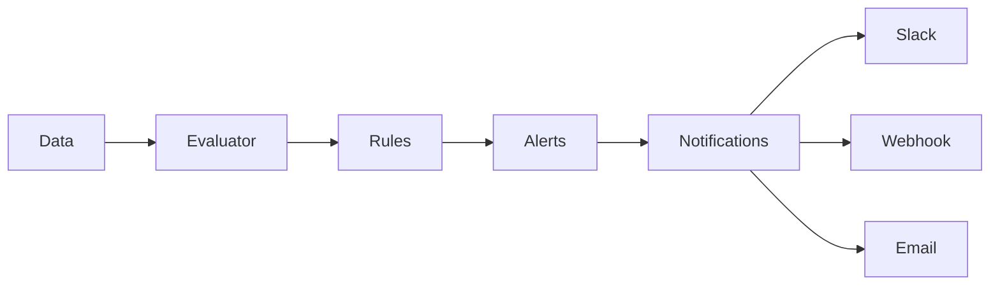
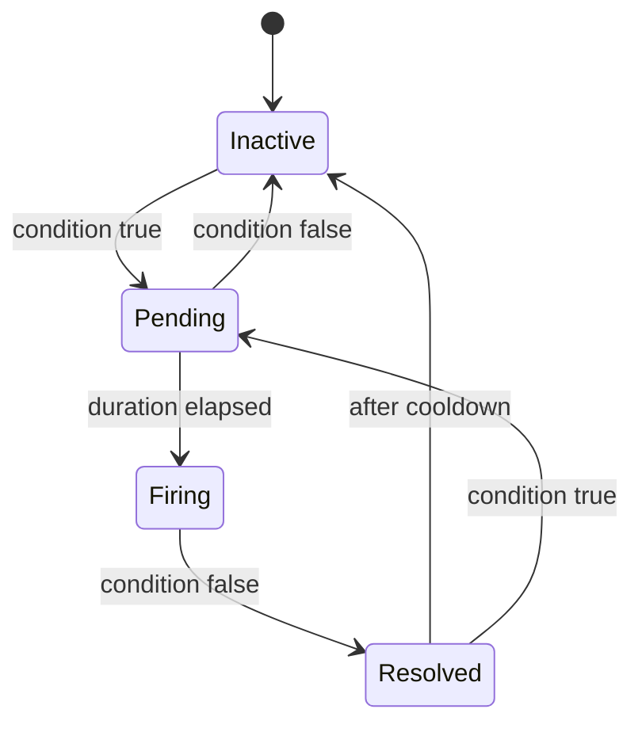

# Alerting

Chronicle includes a built-in alerting engine that evaluates rules against your metrics and triggers notifications.

## Overview



## Creating Alert Rules

### Using the Go API

```go
engine := chronicle.NewAlertEngine(db, chronicle.AlertConfig{
    EvaluationInterval: time.Minute,
    NotificationURL:    "https://hooks.slack.com/services/xxx",
})

// Add a rule
engine.AddRule(chronicle.AlertRule{
    Name:        "HighCPU",
    Expression:  "avg(cpu_usage) > 90",
    Duration:    5 * time.Minute,  // Must be true for 5 min
    Labels:      map[string]string{"severity": "warning"},
    Annotations: map[string]string{
        "summary":     "High CPU usage detected",
        "description": "CPU usage is above 90% for 5 minutes",
    },
})

engine.Start()
defer engine.Stop()
```

### Using the HTTP API

```bash
curl -X POST http://localhost:8086/api/v1/rules \
  -H "Content-Type: application/json" \
  -d '{
    "name": "HighCPU",
    "expr": "avg(cpu_usage) > 90",
    "for": "5m",
    "labels": {"severity": "warning"},
    "annotations": {
      "summary": "High CPU usage detected",
      "description": "CPU usage is above 90% for 5 minutes"
    }
  }'
```

## Alert Rule Structure

```go
type AlertRule struct {
    Name        string            // Unique rule name
    Expression  string            // PromQL expression
    Duration    time.Duration     // How long condition must be true
    Labels      map[string]string // Labels attached to alerts
    Annotations map[string]string // Metadata (summary, description)
}
```

## Alert States

| State | Description |
|-------|-------------|
| **Inactive** | Condition is false |
| **Pending** | Condition is true, waiting for duration |
| **Firing** | Condition true for duration, alert active |
| **Resolved** | Was firing, now inactive |



## Example Alert Rules

### Infrastructure

```go
// High CPU
engine.AddRule(chronicle.AlertRule{
    Name:       "HighCPU",
    Expression: "avg by (host) (cpu_usage) > 90",
    Duration:   5 * time.Minute,
    Labels:     map[string]string{"severity": "warning", "team": "infra"},
})

// Low disk space
engine.AddRule(chronicle.AlertRule{
    Name:       "LowDiskSpace",
    Expression: "disk_used_percent > 85",
    Duration:   10 * time.Minute,
    Labels:     map[string]string{"severity": "warning"},
})

// Memory pressure
engine.AddRule(chronicle.AlertRule{
    Name:       "HighMemory",
    Expression: "memory_used / memory_total * 100 > 95",
    Duration:   2 * time.Minute,
    Labels:     map[string]string{"severity": "critical"},
})
```

### Application

```go
// High error rate
engine.AddRule(chronicle.AlertRule{
    Name: "HighErrorRate",
    Expression: `
        sum(rate(http_requests_total{status=~"5.."}[5m])) 
        / sum(rate(http_requests_total[5m])) * 100 > 5
    `,
    Duration: 2 * time.Minute,
    Labels:   map[string]string{"severity": "critical", "team": "backend"},
})

// High latency
engine.AddRule(chronicle.AlertRule{
    Name:       "HighLatency",
    Expression: "histogram_quantile(0.99, rate(request_duration_bucket[5m])) > 1",
    Duration:   5 * time.Minute,
    Labels:     map[string]string{"severity": "warning"},
})

// Service down
engine.AddRule(chronicle.AlertRule{
    Name:       "ServiceDown",
    Expression: "up == 0",
    Duration:   1 * time.Minute,
    Labels:     map[string]string{"severity": "critical"},
})
```

## Notifications

### Webhook

```go
engine := chronicle.NewAlertEngine(db, chronicle.AlertConfig{
    NotificationURL: "https://your-webhook.com/alerts",
})
```

Webhook payload:

```json
{
  "status": "firing",
  "alerts": [
    {
      "status": "firing",
      "labels": {
        "alertname": "HighCPU",
        "severity": "warning",
        "host": "server-01"
      },
      "annotations": {
        "summary": "High CPU usage detected"
      },
      "startsAt": "2024-01-28T12:00:00Z",
      "endsAt": "0001-01-01T00:00:00Z",
      "value": "92.5"
    }
  ]
}
```

### Slack

Use Slack incoming webhooks:

```go
engine := chronicle.NewAlertEngine(db, chronicle.AlertConfig{
    NotificationURL: "https://hooks.slack.com/services/T00/B00/xxx",
})
```

### PagerDuty

```go
engine := chronicle.NewAlertEngine(db, chronicle.AlertConfig{
    NotificationURL: "https://events.pagerduty.com/v2/enqueue",
    NotificationHeaders: map[string]string{
        "Authorization": "Token token=YOUR_KEY",
    },
})
```

### Custom Handler

```go
engine.SetNotificationHandler(func(alerts []chronicle.Alert) error {
    for _, alert := range alerts {
        if alert.Labels["severity"] == "critical" {
            // Send SMS
            sendSMS(alert.Annotations["summary"])
        }
        // Log all alerts
        log.Printf("Alert %s: %s", alert.Status, alert.Labels["alertname"])
    }
    return nil
})
```

## Managing Alerts

### List Rules

```bash
curl http://localhost:8086/api/v1/rules
```

### List Active Alerts

```bash
curl http://localhost:8086/api/v1/alerts
```

### Delete Rule

```bash
curl -X DELETE "http://localhost:8086/api/v1/rules?name=HighCPU"
```

### Silence Alerts

```go
engine.Silence(chronicle.Silence{
    Matchers: []chronicle.Matcher{
        {Name: "host", Value: "server-01"},
    },
    StartsAt: time.Now(),
    EndsAt:   time.Now().Add(2 * time.Hour),
    Comment:  "Maintenance window",
})
```

## Best Practices

1. **Use meaningful durations** - Avoid false positives with appropriate `for` durations
2. **Add context in annotations** - Include runbook links, affected services
3. **Use severity labels** - Prioritize alerts (critical, warning, info)
4. **Group related alerts** - Use labels for routing and grouping
5. **Test before deploying** - Verify expressions return expected results
