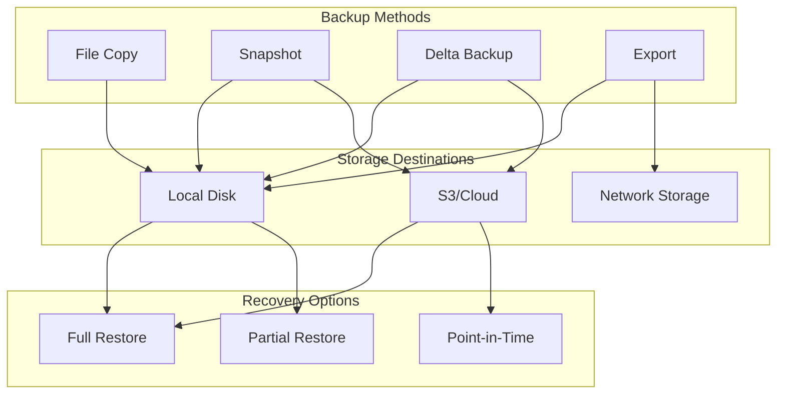
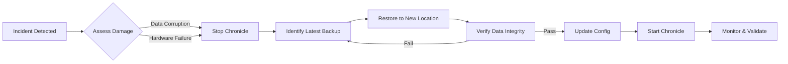

# Backup & Restore

Chronicle provides multiple backup strategies to protect your data.

## Backup Strategy Overview



## Backup Methods

| Method | Use Case | Recovery Time | Storage |
|--------|----------|---------------|---------|
| File copy | Simple, small DBs | Fast | 1x |
| Snapshot | Consistent state | Fast | 1x |
| Delta backup | Large DBs, frequent | Fast | Incremental |
| Export | Migration, archive | Slow | Variable |

## File Copy Backup

For simple deployments, copy the database files while Chronicle is stopped:

```bash
# Stop Chronicle first (or use snapshot)
cp /var/lib/chronicle/data.db /backup/data.db
cp /var/lib/chronicle/data.db.wal* /backup/
```

:::warning
Direct file copy while Chronicle is running may result in corruption. Use snapshots for live backups.
:::

## Snapshot Backup

Create a consistent snapshot while Chronicle is running:

```go
backup := chronicle.NewBackupManager(db)

// Create snapshot
err := backup.CreateSnapshot("/backup/snapshot-2024-01-28")
if err != nil {
    log.Fatal(err)
}
```

The snapshot contains:
- Database file (consistent state)
- WAL files (for recovery)
- Metadata (version, timestamp)

## Delta Backup

For large databases, use incremental backups:

```go
backup := chronicle.NewBackupManager(db)

// First backup (full)
state, err := backup.CreateDeltaBackup(chronicle.DeltaBackupConfig{
    Destination: "/backup/delta",
    BaseState:   nil,  // Full backup
})

// Save state for next backup
saveState(state)

// Subsequent backups (incremental)
prevState := loadState()
state, err = backup.CreateDeltaBackup(chronicle.DeltaBackupConfig{
    Destination: "/backup/delta",
    BaseState:   prevState,
})
```

### Delta Backup Structure

```
/backup/delta/
├── manifest.json       # Backup metadata
├── base/              # Full backup (first time)
│   └── data.db
├── delta-001/         # First increment
│   └── changes.db
├── delta-002/         # Second increment
│   └── changes.db
└── state.json         # Current state
```

## Restore

### From Snapshot

```go
// Stop Chronicle first
db.Close()

// Restore snapshot
err := chronicle.RestoreSnapshot("/backup/snapshot-2024-01-28", "/var/lib/chronicle/")

// Restart Chronicle
db, err = chronicle.Open("/var/lib/chronicle/data.db", config)
```

### From Delta Backup

```go
// Restore full + all deltas
err := chronicle.RestoreDeltaBackup(chronicle.RestoreConfig{
    Source:      "/backup/delta",
    Destination: "/var/lib/chronicle/",
    PointInTime: time.Now(),  // Optional: restore to specific time
})
```

## Export/Import

For migration or archival:

### Export to Files

```go
exporter := chronicle.NewExporter(db)

// Export to CSV
file, _ := os.Create("backup.csv")
exporter.Export(context.Background(), chronicle.ExportOptions{
    Format: chronicle.ExportCSV,
    Output: file,
})

// Export to JSON
file, _ = os.Create("backup.json")
exporter.Export(context.Background(), chronicle.ExportOptions{
    Format: chronicle.ExportJSON,
    Output: file,
})

// Export specific time range
exporter.Export(context.Background(), chronicle.ExportOptions{
    Format: chronicle.ExportCSV,
    Query: &chronicle.Query{
        Start: time.Now().Add(-24 * time.Hour).UnixNano(),
        End:   time.Now().UnixNano(),
    },
    Output: file,
})
```

### Import from Files

```go
// Import from CSV
file, _ := os.Open("backup.csv")
importer := chronicle.NewImporter(db)
err := importer.Import(context.Background(), chronicle.ImportOptions{
    Format: chronicle.ExportCSV,
    Input:  file,
})
```

## S3 Backup

Backup directly to S3:

```go
backend, _ := chronicle.NewS3Backend(chronicle.S3Config{
    Bucket: "my-backups",
    Prefix: "chronicle/",
    Region: "us-west-2",
})

backup := chronicle.NewBackupManager(db)

// Backup to S3
err := backup.BackupToStorage(context.Background(), backend, chronicle.BackupOptions{
    Prefix: fmt.Sprintf("backup-%s/", time.Now().Format("2006-01-02")),
})
```

## Automated Backups

### Cron-based

```bash
# /etc/cron.d/chronicle-backup
0 * * * * root /usr/local/bin/chronicle-backup.sh
```

```bash
#!/bin/bash
# chronicle-backup.sh
DATE=$(date +%Y-%m-%d-%H)
/usr/local/bin/chronicle backup create \
  --source /var/lib/chronicle/data.db \
  --dest /backup/chronicle-$DATE

# Keep last 24 hourly backups
find /backup -name "chronicle-*" -mtime +1 -delete
```

### In-Application

```go
func startBackupScheduler(db *chronicle.DB) {
    ticker := time.NewTicker(time.Hour)
    go func() {
        for range ticker.C {
            backup := chronicle.NewBackupManager(db)
            dest := fmt.Sprintf("/backup/hourly-%s", time.Now().Format("2006-01-02-15"))
            
            if err := backup.CreateSnapshot(dest); err != nil {
                log.Printf("Backup failed: %v", err)
            } else {
                log.Printf("Backup created: %s", dest)
            }
            
            // Cleanup old backups
            cleanupOldBackups("/backup", 24)
        }
    }()
}
```

## Verification

Always verify backups:

```go
// Verify backup integrity
valid, err := chronicle.VerifyBackup("/backup/snapshot-2024-01-28")
if !valid {
    log.Fatal("Backup verification failed:", err)
}

// Test restore
testDB, err := chronicle.Open("/tmp/restore-test/data.db", config)
if err != nil {
    log.Fatal("Restore test failed:", err)
}
defer testDB.Close()

// Verify data
metrics := testDB.Metrics()
log.Printf("Restored %d metrics", len(metrics))
```

## Disaster Recovery

### Recovery Flow



### Recovery Procedure

1. **Stop the affected Chronicle instance**
2. **Identify latest valid backup**
3. **Restore to new location**
4. **Verify data integrity**
5. **Update configuration**
6. **Start Chronicle**

```bash
# 1. Stop
systemctl stop chronicle

# 2. Find latest backup
ls -la /backup/

# 3. Restore
chronicle restore --source /backup/latest --dest /var/lib/chronicle/

# 4. Verify
chronicle verify --path /var/lib/chronicle/data.db

# 5. Start
systemctl start chronicle
```

### Recovery Testing

Schedule regular recovery drills:

```bash
#!/bin/bash
# Monthly recovery test
BACKUP_DIR="/backup"
TEST_DIR="/tmp/recovery-test"
LATEST=$(ls -t $BACKUP_DIR | head -1)

echo "Testing recovery from $LATEST..."
chronicle restore --source "$BACKUP_DIR/$LATEST" --dest "$TEST_DIR"
chronicle verify --path "$TEST_DIR/data.db"

if [ $? -eq 0 ]; then
    echo "Recovery test PASSED"
else
    echo "Recovery test FAILED"
    exit 1
fi

rm -rf "$TEST_DIR"
```

## Best Practices

1. **Test restores regularly** - A backup is only good if you can restore it
2. **Store backups off-site** - Use S3, GCS, or remote servers
3. **Encrypt sensitive backups** - Use encryption at rest
4. **Monitor backup success** - Alert on failures
5. **Document procedures** - Maintain runbooks for recovery
