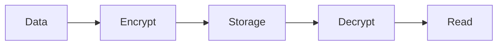

# Encryption

Chronicle supports encryption at rest to protect sensitive metrics data.

## Overview

Chronicle uses AES-256-GCM encryption for data at rest:

- **Algorithm**: AES-256-GCM (authenticated encryption)
- **Scope**: Data files and WAL
- **Performance**: ~5-10% overhead



## Enabling Encryption

### Basic Setup

```go
db, err := chronicle.Open("data.db", chronicle.Config{
    Path: "data.db",
    Encryption: &chronicle.EncryptionConfig{
        Enabled:   true,
        Algorithm: chronicle.EncryptionAES256GCM,
        Key:       []byte("your-32-byte-encryption-key-here"),
    },
})
```

### Key Requirements

| Algorithm | Key Size |
|-----------|----------|
| AES-256-GCM | 32 bytes |

Generate a secure key:

```go
import "crypto/rand"

func generateKey() ([]byte, error) {
    key := make([]byte, 32)
    _, err := rand.Read(key)
    return key, err
}
```

```bash
# Or via command line
openssl rand -hex 32
```

## Key Management

### Environment Variable

```go
import "os"

key, err := hex.DecodeString(os.Getenv("CHRONICLE_ENCRYPTION_KEY"))
if err != nil {
    log.Fatal("Invalid encryption key")
}

db, _ := chronicle.Open("data.db", chronicle.Config{
    Encryption: &chronicle.EncryptionConfig{
        Enabled: true,
        Key:     key,
    },
})
```

### Key File

```go
keyData, err := os.ReadFile("/etc/chronicle/encryption.key")
if err != nil {
    log.Fatal(err)
}

db, _ := chronicle.Open("data.db", chronicle.Config{
    Encryption: &chronicle.EncryptionConfig{
        Enabled: true,
        Key:     keyData,
    },
})
```

### HashiCorp Vault

```go
import vault "github.com/hashicorp/vault/api"

func getKeyFromVault() ([]byte, error) {
    client, _ := vault.NewClient(vault.DefaultConfig())
    
    secret, err := client.Logical().Read("secret/data/chronicle")
    if err != nil {
        return nil, err
    }
    
    keyHex := secret.Data["data"].(map[string]interface{})["key"].(string)
    return hex.DecodeString(keyHex)
}

key, _ := getKeyFromVault()
db, _ := chronicle.Open("data.db", chronicle.Config{
    Encryption: &chronicle.EncryptionConfig{
        Enabled: true,
        Key:     key,
    },
})
```

### AWS KMS

```go
import (
    "github.com/aws/aws-sdk-go/aws"
    "github.com/aws/aws-sdk-go/aws/session"
    "github.com/aws/aws-sdk-go/service/kms"
)

func getKeyFromKMS(keyID string) ([]byte, error) {
    sess := session.Must(session.NewSession())
    svc := kms.New(sess)
    
    // Generate data key
    result, err := svc.GenerateDataKey(&kms.GenerateDataKeyInput{
        KeyId:   aws.String(keyID),
        KeySpec: aws.String("AES_256"),
    })
    if err != nil {
        return nil, err
    }
    
    return result.Plaintext, nil
}
```

## Encrypting Existing Data

To encrypt an existing unencrypted database:

```go
// 1. Export data from unencrypted DB
srcDB, _ := chronicle.Open("data.db", chronicle.DefaultConfig("data.db"))
exporter := chronicle.NewExporter(srcDB)

file, _ := os.Create("export.json")
exporter.Export(context.Background(), chronicle.ExportOptions{
    Format: chronicle.ExportJSON,
    Output: file,
})
srcDB.Close()

// 2. Create encrypted DB and import
dstDB, _ := chronicle.Open("encrypted.db", chronicle.Config{
    Path: "encrypted.db",
    Encryption: &chronicle.EncryptionConfig{
        Enabled: true,
        Key:     encryptionKey,
    },
})

file, _ = os.Open("export.json")
importer := chronicle.NewImporter(dstDB)
importer.Import(context.Background(), chronicle.ImportOptions{
    Format: chronicle.ExportJSON,
    Input:  file,
})
dstDB.Close()

// 3. Replace original
os.Remove("data.db")
os.Rename("encrypted.db", "data.db")
```

## Key Rotation

To rotate encryption keys:

```go
// 1. Create new key
newKey := generateKey()

// 2. Re-encrypt with new key (requires export/import)
backup := chronicle.NewBackupManager(db)
backup.CreateSnapshot("/backup/pre-rotation")

// 3. Update key in your key management system
updateKeyInVault(newKey)

// 4. Restart with new key
db.Close()
db, _ = chronicle.Open("data.db", chronicle.Config{
    Encryption: &chronicle.EncryptionConfig{
        Enabled: true,
        Key:     newKey,
    },
})
```

## Backup Considerations

Encrypted databases require the encryption key to restore:

```go
// Backup (encrypted data is backed up as-is)
backup := chronicle.NewBackupManager(db)
backup.CreateSnapshot("/backup/encrypted-snapshot")

// Restore requires same key
db, _ := chronicle.Open("/backup/encrypted-snapshot/data.db", chronicle.Config{
    Encryption: &chronicle.EncryptionConfig{
        Enabled: true,
        Key:     originalKey,  // Must match!
    },
})
```

:::warning
**Store encryption keys separately from backups!** Storing the key with the backup defeats the purpose of encryption.
:::

## Performance Impact

Encryption adds computational overhead:

| Operation | Overhead |
|-----------|----------|
| Write | ~5-10% |
| Read | ~5-10% |
| Compaction | ~10-15% |

For high-throughput scenarios, consider:
- Using hardware AES acceleration (AES-NI)
- Larger buffer sizes to reduce encryption operations

## Verification

Verify encryption is working:

```go
// Check if database is encrypted
info := db.Info()
fmt.Printf("Encryption enabled: %v\n", info.Encrypted)
fmt.Printf("Algorithm: %s\n", info.EncryptionAlgorithm)

// Verify data is encrypted on disk
data, _ := os.ReadFile("data.db")
if bytes.Contains(data, []byte("cpu_usage")) {
    log.Fatal("Data appears unencrypted!")
}
```

## Troubleshooting

### Wrong Key Error

```
error: encryption key mismatch
```

The provided key doesn't match the key used to encrypt the database.

### Corrupted Data

```
error: authentication failed
```

The encrypted data has been modified or corrupted. Restore from backup.

### Performance Issues

If encryption is causing performance problems:
1. Verify AES-NI is enabled: `grep aes /proc/cpuinfo`
2. Increase buffer sizes
3. Use faster storage (SSD/NVMe)
