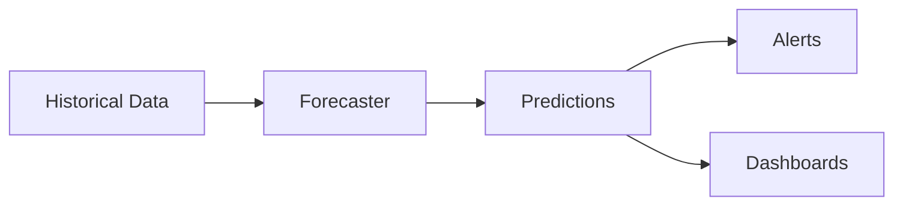

# Time-Series Forecasting

Chronicle includes built-in forecasting capabilities using the Holt-Winters algorithm for predicting future values.

## Overview



## Creating Forecasts

### Basic Usage

```go
forecaster := chronicle.NewForecaster(db, chronicle.ForecastConfig{
    SeasonalPeriod: 24, // 24-hour seasonality
    Alpha:          0.3, // Level smoothing
    Beta:           0.1, // Trend smoothing
    Gamma:          0.1, // Seasonal smoothing
})

forecast, err := forecaster.Forecast(chronicle.ForecastRequest{
    Metric:  "cpu_usage",
    Tags:    map[string]string{"host": "server-01"},
    Horizon: 24 * time.Hour, // Predict next 24 hours
})

for _, point := range forecast.Predictions {
    fmt.Printf("%v: %.2f (±%.2f)\n", 
        time.Unix(0, point.Timestamp),
        point.Value,
        point.Confidence)
}
```

### HTTP API

```bash
curl "http://localhost:8086/api/v1/forecast?\
metric=cpu_usage&\
tags=host:server-01&\
horizon=24h"
```

Response:

```json
{
  "metric": "cpu_usage",
  "predictions": [
    {"timestamp": 1706486400000000000, "value": 45.2, "confidence": 5.3},
    {"timestamp": 1706490000000000000, "value": 52.1, "confidence": 6.1},
    {"timestamp": 1706493600000000000, "value": 48.7, "confidence": 6.8}
  ]
}
```

## Holt-Winters Algorithm

Chronicle uses triple exponential smoothing (Holt-Winters) which handles:
- **Level**: The baseline value
- **Trend**: Direction and rate of change
- **Seasonality**: Repeating patterns

### Parameters

| Parameter | Range | Description |
|-----------|-------|-------------|
| `Alpha` | 0-1 | Level smoothing (higher = more reactive) |
| `Beta` | 0-1 | Trend smoothing (higher = faster trend changes) |
| `Gamma` | 0-1 | Seasonal smoothing (higher = more seasonal adaptation) |
| `SeasonalPeriod` | Integer | Number of points in one season |

### Choosing Parameters

```go
// Stable metrics with daily patterns
config := chronicle.ForecastConfig{
    SeasonalPeriod: 24,   // Daily seasonality (hourly data)
    Alpha:          0.2,  // Smooth level
    Beta:           0.1,  // Stable trend
    Gamma:          0.3,  // Moderate seasonality
}

// Volatile metrics needing quick adaptation
config := chronicle.ForecastConfig{
    SeasonalPeriod: 24,
    Alpha:          0.5,  // Reactive level
    Beta:           0.3,  // Quick trend adaptation
    Gamma:          0.2,  // Less seasonal weight
}
```

## Use Cases

### Capacity Planning

```go
// Forecast disk usage for next 7 days
forecast, _ := forecaster.Forecast(chronicle.ForecastRequest{
    Metric:  "disk_used_bytes",
    Horizon: 7 * 24 * time.Hour,
})

// Check if we'll run out of space
for _, p := range forecast.Predictions {
    if p.Value > maxDiskBytes {
        alert("Disk will be full by %v", time.Unix(0, p.Timestamp))
        break
    }
}
```

### Anomaly Detection

```go
// Get forecast for current hour
forecast, _ := forecaster.Forecast(chronicle.ForecastRequest{
    Metric:  "request_count",
    Horizon: time.Hour,
})

// Compare actual vs predicted
actual, _ := db.Execute(&chronicle.Query{
    Metric: "request_count",
    Start:  time.Now().Add(-time.Hour).UnixNano(),
    End:    time.Now().UnixNano(),
})

for i, p := range actual.Points {
    predicted := forecast.Predictions[i]
    deviation := math.Abs(p.Value - predicted.Value) / predicted.Confidence
    
    if deviation > 3 { // 3 standard deviations
        alert("Anomaly detected: %.2f vs predicted %.2f", p.Value, predicted.Value)
    }
}
```

### Proactive Alerting

```go
// Alert before CPU becomes critical
forecaster.SetAlertThreshold("cpu_usage", chronicle.ForecastAlert{
    Threshold:   90,
    HoursAhead:  2,
    Operator:    ">",
    Callback: func(metric string, predicted float64, when time.Time) {
        sendAlert("CPU predicted to reach %.1f%% at %v", predicted, when)
    },
})
```

## Forecast Quality

### Confidence Intervals

Each prediction includes a confidence value (standard deviation):

```go
for _, p := range forecast.Predictions {
    lower := p.Value - 2*p.Confidence // 95% confidence
    upper := p.Value + 2*p.Confidence
    
    fmt.Printf("%.2f (%.2f - %.2f)\n", p.Value, lower, upper)
}
```

### Evaluating Accuracy

```go
// Backtest forecast accuracy
accuracy := forecaster.Evaluate(chronicle.EvaluateRequest{
    Metric:      "cpu_usage",
    TestPeriod:  7 * 24 * time.Hour,
    Horizon:     time.Hour,
})

fmt.Printf("MAPE: %.2f%%\n", accuracy.MAPE)
fmt.Printf("MAE: %.2f\n", accuracy.MAE)
fmt.Printf("RMSE: %.2f\n", accuracy.RMSE)
```

## Visualization

### Grafana Dashboard

```promql
# Historical data
cpu_usage{host="server-01"}

# Add forecast annotation
# (requires custom panel or annotation query)
```

### Example Dashboard Panel

```json
{
  "title": "CPU Usage with Forecast",
  "type": "timeseries",
  "targets": [
    {
      "expr": "cpu_usage{host='server-01'}",
      "legendFormat": "Actual"
    }
  ],
  "fieldConfig": {
    "defaults": {
      "custom": {
        "lineStyle": {"fill": "solid"}
      }
    },
    "overrides": [
      {
        "matcher": {"id": "byName", "options": "Forecast"},
        "properties": [
          {"id": "custom.lineStyle", "value": {"fill": "dash"}}
        ]
      }
    ]
  }
}
```

## Best Practices

1. **Sufficient history** - Need at least 2-3 seasonal periods of data
2. **Regular intervals** - Works best with evenly-spaced data points
3. **Handle missing data** - Fill gaps before forecasting
4. **Tune parameters** - Use backtesting to find optimal values
5. **Short-term focus** - Accuracy decreases with longer horizons

## Limitations

- Works best for metrics with clear patterns
- Long-term forecasts (>7 days) have high uncertainty
- Sudden changes (deployments, outages) aren't predicted
- Requires sufficient historical data
