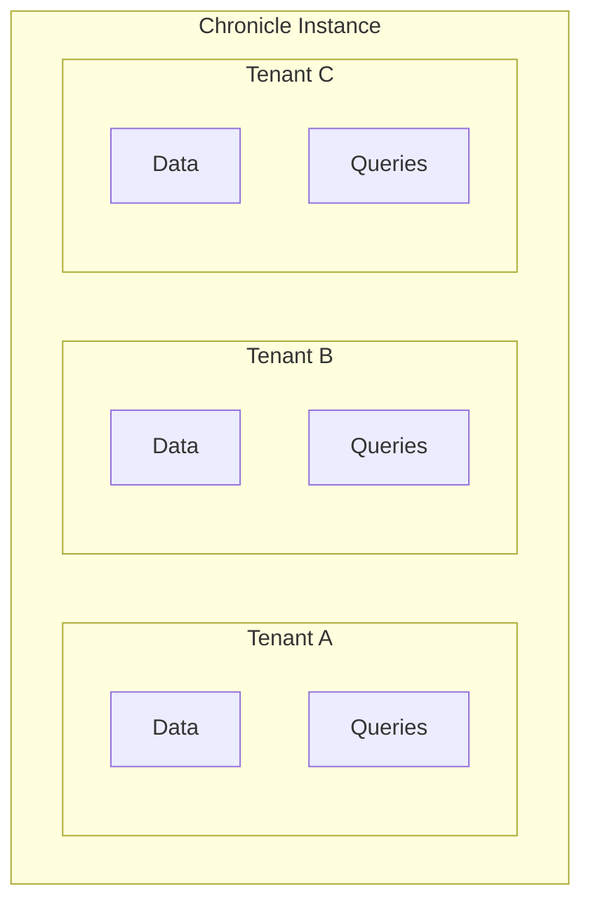
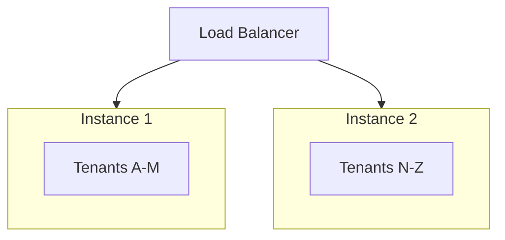

# Multi-Tenancy

Chronicle supports multi-tenant deployments where multiple isolated tenants share a single instance.

## Overview

Multi-tenancy isolates data between tenants:



## Enabling Multi-Tenancy

```go
manager := chronicle.NewTenantManager(chronicle.TenantConfig{
    BasePath:        "/var/lib/chronicle/tenants",
    MaxTenantsCount: 100,
    DefaultConfig:   chronicle.DefaultConfig(""),
})
```

## Tenant Operations

### Create Tenant

```go
err := manager.CreateTenant("tenant-a", chronicle.TenantOptions{
    MaxStorageBytes:   10 * 1024 * 1024 * 1024, // 10GB
    RetentionDuration: 30 * 24 * time.Hour,
})
```

### Get Tenant Database

```go
db, err := manager.GetTenant("tenant-a")
if err != nil {
    log.Fatal(err)
}

// Write data for this tenant
db.Write(chronicle.Point{
    Metric: "cpu_usage",
    Value:  45.2,
})
```

### List Tenants

```go
tenants := manager.ListTenants()
for _, t := range tenants {
    fmt.Printf("Tenant: %s, Storage: %d bytes\n", t.ID, t.StorageUsed)
}
```

### Delete Tenant

```go
err := manager.DeleteTenant("tenant-a")
```

## HTTP API with Tenants

Chronicle's HTTP API supports tenant isolation via headers:

```bash
# Write to specific tenant
curl -X POST http://localhost:8086/write \
  -H "X-Tenant-ID: tenant-a" \
  -d 'cpu_usage,host=server-01 value=45.7'

# Query specific tenant
curl -X POST http://localhost:8086/query \
  -H "X-Tenant-ID: tenant-a" \
  -H "Content-Type: application/json" \
  -d '{"metric": "cpu_usage"}'
```

### Enable Tenant Header

```go
db, _ := chronicle.Open("data.db", chronicle.Config{
    HTTPEnabled:        true,
    HTTPPort:           8086,
    MultiTenantEnabled: true,
})
```

## Tenant Isolation

### Data Isolation

Each tenant has completely separate:
- Data storage
- Indexes
- WAL files
- Configuration

```
/var/lib/chronicle/tenants/
├── tenant-a/
│   ├── data.db
│   ├── data.db.wal
│   └── config.json
├── tenant-b/
│   ├── data.db
│   ├── data.db.wal
│   └── config.json
└── tenant-c/
    ├── data.db
    ├── data.db.wal
    └── config.json
```

### Resource Limits

Set per-tenant limits:

```go
manager.CreateTenant("tenant-a", chronicle.TenantOptions{
    MaxStorageBytes:    10 * 1024 * 1024 * 1024, // 10GB max
    MaxSeriesCount:     100_000,                  // 100k series max
    MaxWritesPerSecond: 10_000,                   // Rate limit
    MaxQueryDuration:   30 * time.Second,         // Query timeout
})
```

### Query Isolation

Queries are automatically scoped to the tenant:

```go
// This only returns tenant-a's data
db, _ := manager.GetTenant("tenant-a")
result, _ := db.Execute(&chronicle.Query{
    Metric: "cpu_usage",
})
// result contains only tenant-a's cpu_usage data
```

## Authentication

Chronicle doesn't include built-in authentication. Implement tenant authentication in your application or reverse proxy:

### Application-Level

```go
func handleWrite(w http.ResponseWriter, r *http.Request) {
    // Authenticate request
    tenantID, err := authenticateRequest(r)
    if err != nil {
        http.Error(w, "Unauthorized", http.StatusUnauthorized)
        return
    }
    
    // Get tenant database
    db, err := manager.GetTenant(tenantID)
    if err != nil {
        http.Error(w, "Tenant not found", http.StatusNotFound)
        return
    }
    
    // Process write
    // ...
}
```

### Reverse Proxy (nginx)

```nginx
location /write {
    # Validate API key and extract tenant
    auth_request /auth;
    auth_request_set $tenant_id $upstream_http_x_tenant_id;
    
    # Forward to Chronicle with tenant header
    proxy_pass http://chronicle:8086/write;
    proxy_set_header X-Tenant-ID $tenant_id;
}
```

## Monitoring

### Per-Tenant Metrics

```go
tenants := manager.ListTenants()
for _, t := range tenants {
    stats := t.Stats()
    fmt.Printf("Tenant %s:\n", t.ID)
    fmt.Printf("  Storage: %d MB\n", stats.StorageBytes/1024/1024)
    fmt.Printf("  Series: %d\n", stats.SeriesCount)
    fmt.Printf("  Points: %d\n", stats.PointCount)
    fmt.Printf("  Write rate: %.2f/s\n", stats.WriteRate)
}
```

### Alerts

```go
// Alert when tenant approaches limit
for _, t := range tenants {
    if t.StorageUsed > t.MaxStorage*0.9 {
        alertTenantNearLimit(t.ID, t.StorageUsed, t.MaxStorage)
    }
}
```

## Scaling

### Vertical Scaling

Increase resources for the Chronicle instance:
- More memory for buffers
- Faster storage for better I/O
- More CPU for query processing

### Horizontal Scaling

For very large deployments, shard tenants across instances:



## Best Practices

1. **Set resource limits** - Prevent one tenant from impacting others
2. **Monitor per-tenant usage** - Track storage, series, and query patterns
3. **Implement authentication** - Never rely on header-only tenant identification
4. **Regular backups** - Back up each tenant independently
5. **Capacity planning** - Monitor growth and plan for scaling
