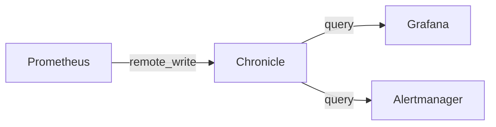

# Prometheus Integration

Chronicle provides full Prometheus compatibility, including PromQL queries, remote write, and metrics scraping.

## PromQL Support

### Enable PromQL

PromQL is available via the Go API and HTTP endpoints:

```go
// Go API
executor := chronicle.NewPromQLExecutor(db)

// HTTP (always enabled when HTTPEnabled: true)
// GET /api/v1/query
// GET /api/v1/query_range
```

### Instant Queries

Query the current value:

```go
result, err := executor.Query(
    `http_requests_total{method="GET"}`,
    time.Now(),
)
```

Via HTTP:

```bash
curl "http://localhost:8086/api/v1/query?query=http_requests_total{method='GET'}"
```

### Range Queries

Query over a time range:

```go
result, err := executor.QueryRange(
    `rate(http_requests_total[5m])`,
    time.Now().Add(-time.Hour),  // Start
    time.Now(),                   // End
    time.Minute,                  // Step
)
```

Via HTTP:

```bash
curl "http://localhost:8086/api/v1/query_range?\
query=rate(http_requests_total[5m])&\
start=2024-01-28T00:00:00Z&\
end=2024-01-28T12:00:00Z&\
step=60"
```

## Supported PromQL Features

### Selectors

```promql
# Exact match
http_requests_total{method="GET"}

# Not equal
http_requests_total{method!="POST"}

# Regex match
http_requests_total{method=~"GET|POST"}

# Negative regex
http_requests_total{method!~"DELETE|PATCH"}

# Multiple labels
http_requests_total{method="GET", status="200", env!="dev"}
```

### Range Vectors

```promql
# Last 5 minutes
http_requests_total[5m]

# Last hour
cpu_usage[1h]

# Last 7 days
memory_used[7d]
```

### Functions

| Function | Description | Example |
|----------|-------------|---------|
| `rate()` | Per-second rate | `rate(requests_total[5m])` |
| `irate()` | Instant rate | `irate(requests_total[5m])` |
| `increase()` | Total increase | `increase(requests_total[1h])` |
| `sum()` | Sum values | `sum(cpu_usage)` |
| `avg()` | Average | `avg(cpu_usage)` |
| `min()` | Minimum | `min(temperature)` |
| `max()` | Maximum | `max(temperature)` |
| `count()` | Count series | `count(up)` |
| `histogram_quantile()` | Percentile | `histogram_quantile(0.95, rate(duration_bucket[5m]))` |

### Aggregation Operators

```promql
# Sum by label
sum by (host) (cpu_usage)

# Average without label
avg without (instance) (memory_used)

# Multiple labels
sum by (region, service) (http_requests_total)
```

### Binary Operators

```promql
# Arithmetic
cpu_usage / 100
memory_used / 1024 / 1024 / 1024

# Comparison (filtering)
cpu_usage > 80
http_errors / http_requests_total > 0.01
```

## Prometheus Remote Write

Chronicle can receive data from Prometheus via remote write.

### Enable Remote Write Receiver

```go
db, _ := chronicle.Open("data.db", chronicle.Config{
    HTTPEnabled:                  true,
    HTTPPort:                     8086,
    PrometheusRemoteWriteEnabled: true,
})
```

### Configure Prometheus

Add to `prometheus.yml`:

```yaml
remote_write:
  - url: "http://chronicle:8086/prometheus/write"
    queue_config:
      capacity: 10000
      max_shards: 10
      max_samples_per_send: 5000
```

### Data Flow



## Using Chronicle as Prometheus Remote Storage

Chronicle can serve as long-term storage for Prometheus:

```yaml
# prometheus.yml
remote_write:
  - url: "http://chronicle:8086/prometheus/write"

remote_read:
  - url: "http://chronicle:8086/api/v1/read"
    read_recent: false  # Only query Chronicle for older data
```

## Grafana Integration

Chronicle's Prometheus-compatible endpoints work with Grafana:

1. Add data source: **Prometheus**
2. URL: `http://chronicle:8086`
3. Use standard Prometheus queries

```promql
# Dashboard queries
rate(http_requests_total{job="api"}[5m])
histogram_quantile(0.99, rate(request_duration_bucket[5m]))
sum by (status) (increase(http_requests_total[1h]))
```

## Migrating from Prometheus

### Export from Prometheus

```bash
# Use promtool to export data
promtool tsdb dump /prometheus/data > data.txt
```

### Import to Chronicle

```go
// Read exported data and write to Chronicle
file, _ := os.Open("data.txt")
scanner := bufio.NewScanner(file)

for scanner.Scan() {
    point := parsePrometheusLine(scanner.Text())
    db.Write(point)
}
```

## Example: Full Setup

### Chronicle Server

```go
package main

import (
    "log"
    "github.com/chronicle-db/chronicle"
)

func main() {
    db, err := chronicle.Open("metrics.db", chronicle.Config{
        Path:                         "metrics.db",
        PartitionDuration:            time.Hour,
        RetentionDuration:            30 * 24 * time.Hour,
        HTTPEnabled:                  true,
        HTTPPort:                     8086,
        PrometheusRemoteWriteEnabled: true,
    })
    if err != nil {
        log.Fatal(err)
    }
    defer db.Close()
    
    log.Println("Chronicle running on :8086")
    select {} // Block forever
}
```

### Prometheus Config

```yaml
global:
  scrape_interval: 15s

scrape_configs:
  - job_name: 'app'
    static_configs:
      - targets: ['app:8080']

remote_write:
  - url: "http://chronicle:8086/prometheus/write"
```

### Query Examples

```bash
# Current CPU usage
curl "http://localhost:8086/api/v1/query?query=cpu_usage"

# Request rate over last hour
curl "http://localhost:8086/api/v1/query_range?\
query=rate(http_requests_total[5m])&\
start=$(date -d '1 hour ago' +%s)&\
end=$(date +%s)&\
step=60"

# 99th percentile latency
curl "http://localhost:8086/api/v1/query?\
query=histogram_quantile(0.99, rate(request_duration_bucket[5m]))"
```

## Limitations

Chronicle's PromQL implementation covers common use cases but has some limitations:

| Feature | Status |
|---------|--------|
| Basic selectors | ✅ Supported |
| Range vectors | ✅ Supported |
| `rate()`, `irate()` | ✅ Supported |
| `sum()`, `avg()`, `min()`, `max()` | ✅ Supported |
| `histogram_quantile()` | ✅ Supported |
| `by`, `without` | ✅ Supported |
| Subqueries | ⚠️ Limited |
| `predict_linear()` | ❌ Not yet |
| `holt_winters()` | ❌ Use native forecasting |
| Recording rules | ✅ Supported (native) |
